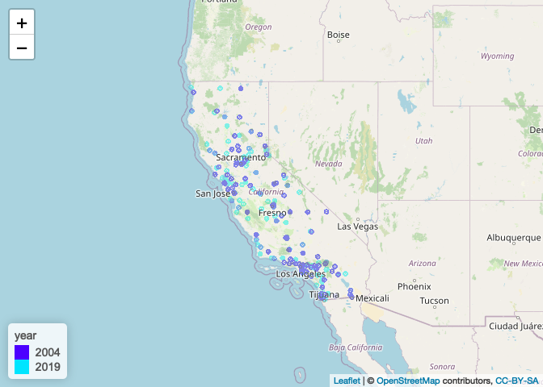

hw01
================
Kaila An
2022-09-23

``` r
library(tidyverse)
```

    ## ── Attaching packages ─────────────────────────────────────── tidyverse 1.3.2 ──
    ## ✔ ggplot2 3.3.6     ✔ purrr   0.3.4
    ## ✔ tibble  3.1.8     ✔ dplyr   1.0.9
    ## ✔ tidyr   1.2.0     ✔ stringr 1.4.1
    ## ✔ readr   2.1.2     ✔ forcats 0.5.2
    ## ── Conflicts ────────────────────────────────────────── tidyverse_conflicts() ──
    ## ✖ dplyr::filter() masks stats::filter()
    ## ✖ dplyr::lag()    masks stats::lag()

``` r
library(data.table)
```

    ## 
    ## Attaching package: 'data.table'
    ## 
    ## The following objects are masked from 'package:dplyr':
    ## 
    ##     between, first, last
    ## 
    ## The following object is masked from 'package:purrr':
    ## 
    ##     transpose

``` r
library(dplyr)
library(ggplot2)
```

## Step 1. Given the formulated question from the assignment description, you will now conduct EDA Checklist items 2-4.

First, download 2004 and 2019 data for all sites in California from the
EPA Air Quality Data website. Read in the data using data.table().

``` r
data04 <- data.table::fread("ad_viz_plotval_2004_data.csv")
data19 <- data.table::fread("ad_viz_plotval_2019_data.csv")
```

For each of the two datasets, check the dimensions, headers, footers,
variable names and variable types.

``` r
dim(data04)
```

    ## [1] 19233    20

``` r
dim(data19)
```

    ## [1] 53156    20

``` r
head(data04)
```

    ##          Date Source  Site ID POC Daily Mean PM2.5 Concentration    UNITS
    ## 1: 01/01/2004    AQS 60010007   1                            8.9 ug/m3 LC
    ## 2: 01/02/2004    AQS 60010007   1                           12.2 ug/m3 LC
    ## 3: 01/03/2004    AQS 60010007   1                           16.5 ug/m3 LC
    ## 4: 01/04/2004    AQS 60010007   1                           18.1 ug/m3 LC
    ## 5: 01/05/2004    AQS 60010007   1                           11.5 ug/m3 LC
    ## 6: 01/06/2004    AQS 60010007   1                           32.5 ug/m3 LC
    ##    DAILY_AQI_VALUE Site Name DAILY_OBS_COUNT PERCENT_COMPLETE
    ## 1:              37 Livermore               1              100
    ## 2:              51 Livermore               1              100
    ## 3:              60 Livermore               1              100
    ## 4:              64 Livermore               1              100
    ## 5:              48 Livermore               1              100
    ## 6:              94 Livermore               1              100
    ##    AQS_PARAMETER_CODE                     AQS_PARAMETER_DESC CBSA_CODE
    ## 1:              88101               PM2.5 - Local Conditions     41860
    ## 2:              88502 Acceptable PM2.5 AQI & Speciation Mass     41860
    ## 3:              88502 Acceptable PM2.5 AQI & Speciation Mass     41860
    ## 4:              88101               PM2.5 - Local Conditions     41860
    ## 5:              88502 Acceptable PM2.5 AQI & Speciation Mass     41860
    ## 6:              88502 Acceptable PM2.5 AQI & Speciation Mass     41860
    ##                            CBSA_NAME STATE_CODE      STATE COUNTY_CODE  COUNTY
    ## 1: San Francisco-Oakland-Hayward, CA          6 California           1 Alameda
    ## 2: San Francisco-Oakland-Hayward, CA          6 California           1 Alameda
    ## 3: San Francisco-Oakland-Hayward, CA          6 California           1 Alameda
    ## 4: San Francisco-Oakland-Hayward, CA          6 California           1 Alameda
    ## 5: San Francisco-Oakland-Hayward, CA          6 California           1 Alameda
    ## 6: San Francisco-Oakland-Hayward, CA          6 California           1 Alameda
    ##    SITE_LATITUDE SITE_LONGITUDE
    ## 1:      37.68753      -121.7842
    ## 2:      37.68753      -121.7842
    ## 3:      37.68753      -121.7842
    ## 4:      37.68753      -121.7842
    ## 5:      37.68753      -121.7842
    ## 6:      37.68753      -121.7842

``` r
head(data19)
```

    ##          Date Source  Site ID POC Daily Mean PM2.5 Concentration    UNITS
    ## 1: 01/01/2019    AQS 60010007   3                            5.7 ug/m3 LC
    ## 2: 01/02/2019    AQS 60010007   3                           11.9 ug/m3 LC
    ## 3: 01/03/2019    AQS 60010007   3                           20.1 ug/m3 LC
    ## 4: 01/04/2019    AQS 60010007   3                           28.8 ug/m3 LC
    ## 5: 01/05/2019    AQS 60010007   3                           11.2 ug/m3 LC
    ## 6: 01/06/2019    AQS 60010007   3                            2.7 ug/m3 LC
    ##    DAILY_AQI_VALUE Site Name DAILY_OBS_COUNT PERCENT_COMPLETE
    ## 1:              24 Livermore               1              100
    ## 2:              50 Livermore               1              100
    ## 3:              68 Livermore               1              100
    ## 4:              86 Livermore               1              100
    ## 5:              47 Livermore               1              100
    ## 6:              11 Livermore               1              100
    ##    AQS_PARAMETER_CODE       AQS_PARAMETER_DESC CBSA_CODE
    ## 1:              88101 PM2.5 - Local Conditions     41860
    ## 2:              88101 PM2.5 - Local Conditions     41860
    ## 3:              88101 PM2.5 - Local Conditions     41860
    ## 4:              88101 PM2.5 - Local Conditions     41860
    ## 5:              88101 PM2.5 - Local Conditions     41860
    ## 6:              88101 PM2.5 - Local Conditions     41860
    ##                            CBSA_NAME STATE_CODE      STATE COUNTY_CODE  COUNTY
    ## 1: San Francisco-Oakland-Hayward, CA          6 California           1 Alameda
    ## 2: San Francisco-Oakland-Hayward, CA          6 California           1 Alameda
    ## 3: San Francisco-Oakland-Hayward, CA          6 California           1 Alameda
    ## 4: San Francisco-Oakland-Hayward, CA          6 California           1 Alameda
    ## 5: San Francisco-Oakland-Hayward, CA          6 California           1 Alameda
    ## 6: San Francisco-Oakland-Hayward, CA          6 California           1 Alameda
    ##    SITE_LATITUDE SITE_LONGITUDE
    ## 1:      37.68753      -121.7842
    ## 2:      37.68753      -121.7842
    ## 3:      37.68753      -121.7842
    ## 4:      37.68753      -121.7842
    ## 5:      37.68753      -121.7842
    ## 6:      37.68753      -121.7842

``` r
tail(data04)
```

    ##          Date Source  Site ID POC Daily Mean PM2.5 Concentration    UNITS
    ## 1: 12/14/2004    AQS 61131003   1                             11 ug/m3 LC
    ## 2: 12/17/2004    AQS 61131003   1                             16 ug/m3 LC
    ## 3: 12/20/2004    AQS 61131003   1                             17 ug/m3 LC
    ## 4: 12/23/2004    AQS 61131003   1                              9 ug/m3 LC
    ## 5: 12/26/2004    AQS 61131003   1                             24 ug/m3 LC
    ## 6: 12/29/2004    AQS 61131003   1                              9 ug/m3 LC
    ##    DAILY_AQI_VALUE            Site Name DAILY_OBS_COUNT PERCENT_COMPLETE
    ## 1:              46 Woodland-Gibson Road               1              100
    ## 2:              59 Woodland-Gibson Road               1              100
    ## 3:              61 Woodland-Gibson Road               1              100
    ## 4:              38 Woodland-Gibson Road               1              100
    ## 5:              76 Woodland-Gibson Road               1              100
    ## 6:              38 Woodland-Gibson Road               1              100
    ##    AQS_PARAMETER_CODE       AQS_PARAMETER_DESC CBSA_CODE
    ## 1:              88101 PM2.5 - Local Conditions     40900
    ## 2:              88101 PM2.5 - Local Conditions     40900
    ## 3:              88101 PM2.5 - Local Conditions     40900
    ## 4:              88101 PM2.5 - Local Conditions     40900
    ## 5:              88101 PM2.5 - Local Conditions     40900
    ## 6:              88101 PM2.5 - Local Conditions     40900
    ##                                  CBSA_NAME STATE_CODE      STATE COUNTY_CODE
    ## 1: Sacramento--Roseville--Arden-Arcade, CA          6 California         113
    ## 2: Sacramento--Roseville--Arden-Arcade, CA          6 California         113
    ## 3: Sacramento--Roseville--Arden-Arcade, CA          6 California         113
    ## 4: Sacramento--Roseville--Arden-Arcade, CA          6 California         113
    ## 5: Sacramento--Roseville--Arden-Arcade, CA          6 California         113
    ## 6: Sacramento--Roseville--Arden-Arcade, CA          6 California         113
    ##    COUNTY SITE_LATITUDE SITE_LONGITUDE
    ## 1:   Yolo      38.66121      -121.7327
    ## 2:   Yolo      38.66121      -121.7327
    ## 3:   Yolo      38.66121      -121.7327
    ## 4:   Yolo      38.66121      -121.7327
    ## 5:   Yolo      38.66121      -121.7327
    ## 6:   Yolo      38.66121      -121.7327

``` r
tail(data19)
```

    ##          Date Source  Site ID POC Daily Mean PM2.5 Concentration    UNITS
    ## 1: 11/11/2019    AQS 61131003   1                           13.5 ug/m3 LC
    ## 2: 11/17/2019    AQS 61131003   1                           18.1 ug/m3 LC
    ## 3: 11/29/2019    AQS 61131003   1                           12.5 ug/m3 LC
    ## 4: 12/17/2019    AQS 61131003   1                           23.8 ug/m3 LC
    ## 5: 12/23/2019    AQS 61131003   1                            1.0 ug/m3 LC
    ## 6: 12/29/2019    AQS 61131003   1                            9.1 ug/m3 LC
    ##    DAILY_AQI_VALUE            Site Name DAILY_OBS_COUNT PERCENT_COMPLETE
    ## 1:              54 Woodland-Gibson Road               1              100
    ## 2:              64 Woodland-Gibson Road               1              100
    ## 3:              52 Woodland-Gibson Road               1              100
    ## 4:              76 Woodland-Gibson Road               1              100
    ## 5:               4 Woodland-Gibson Road               1              100
    ## 6:              38 Woodland-Gibson Road               1              100
    ##    AQS_PARAMETER_CODE       AQS_PARAMETER_DESC CBSA_CODE
    ## 1:              88101 PM2.5 - Local Conditions     40900
    ## 2:              88101 PM2.5 - Local Conditions     40900
    ## 3:              88101 PM2.5 - Local Conditions     40900
    ## 4:              88101 PM2.5 - Local Conditions     40900
    ## 5:              88101 PM2.5 - Local Conditions     40900
    ## 6:              88101 PM2.5 - Local Conditions     40900
    ##                                  CBSA_NAME STATE_CODE      STATE COUNTY_CODE
    ## 1: Sacramento--Roseville--Arden-Arcade, CA          6 California         113
    ## 2: Sacramento--Roseville--Arden-Arcade, CA          6 California         113
    ## 3: Sacramento--Roseville--Arden-Arcade, CA          6 California         113
    ## 4: Sacramento--Roseville--Arden-Arcade, CA          6 California         113
    ## 5: Sacramento--Roseville--Arden-Arcade, CA          6 California         113
    ## 6: Sacramento--Roseville--Arden-Arcade, CA          6 California         113
    ##    COUNTY SITE_LATITUDE SITE_LONGITUDE
    ## 1:   Yolo      38.66121      -121.7327
    ## 2:   Yolo      38.66121      -121.7327
    ## 3:   Yolo      38.66121      -121.7327
    ## 4:   Yolo      38.66121      -121.7327
    ## 5:   Yolo      38.66121      -121.7327
    ## 6:   Yolo      38.66121      -121.7327

``` r
str(data04)
```

    ## Classes 'data.table' and 'data.frame':   19233 obs. of  20 variables:
    ##  $ Date                          : chr  "01/01/2004" "01/02/2004" "01/03/2004" "01/04/2004" ...
    ##  $ Source                        : chr  "AQS" "AQS" "AQS" "AQS" ...
    ##  $ Site ID                       : int  60010007 60010007 60010007 60010007 60010007 60010007 60010007 60010007 60010007 60010007 ...
    ##  $ POC                           : int  1 1 1 1 1 1 1 1 1 1 ...
    ##  $ Daily Mean PM2.5 Concentration: num  8.9 12.2 16.5 18.1 11.5 32.5 14 29.9 21 16.9 ...
    ##  $ UNITS                         : chr  "ug/m3 LC" "ug/m3 LC" "ug/m3 LC" "ug/m3 LC" ...
    ##  $ DAILY_AQI_VALUE               : int  37 51 60 64 48 94 55 88 70 61 ...
    ##  $ Site Name                     : chr  "Livermore" "Livermore" "Livermore" "Livermore" ...
    ##  $ DAILY_OBS_COUNT               : int  1 1 1 1 1 1 1 1 1 1 ...
    ##  $ PERCENT_COMPLETE              : num  100 100 100 100 100 100 100 100 100 100 ...
    ##  $ AQS_PARAMETER_CODE            : int  88101 88502 88502 88101 88502 88502 88101 88502 88502 88502 ...
    ##  $ AQS_PARAMETER_DESC            : chr  "PM2.5 - Local Conditions" "Acceptable PM2.5 AQI & Speciation Mass" "Acceptable PM2.5 AQI & Speciation Mass" "PM2.5 - Local Conditions" ...
    ##  $ CBSA_CODE                     : int  41860 41860 41860 41860 41860 41860 41860 41860 41860 41860 ...
    ##  $ CBSA_NAME                     : chr  "San Francisco-Oakland-Hayward, CA" "San Francisco-Oakland-Hayward, CA" "San Francisco-Oakland-Hayward, CA" "San Francisco-Oakland-Hayward, CA" ...
    ##  $ STATE_CODE                    : int  6 6 6 6 6 6 6 6 6 6 ...
    ##  $ STATE                         : chr  "California" "California" "California" "California" ...
    ##  $ COUNTY_CODE                   : int  1 1 1 1 1 1 1 1 1 1 ...
    ##  $ COUNTY                        : chr  "Alameda" "Alameda" "Alameda" "Alameda" ...
    ##  $ SITE_LATITUDE                 : num  37.7 37.7 37.7 37.7 37.7 ...
    ##  $ SITE_LONGITUDE                : num  -122 -122 -122 -122 -122 ...
    ##  - attr(*, ".internal.selfref")=<externalptr>

``` r
str(data19)
```

    ## Classes 'data.table' and 'data.frame':   53156 obs. of  20 variables:
    ##  $ Date                          : chr  "01/01/2019" "01/02/2019" "01/03/2019" "01/04/2019" ...
    ##  $ Source                        : chr  "AQS" "AQS" "AQS" "AQS" ...
    ##  $ Site ID                       : int  60010007 60010007 60010007 60010007 60010007 60010007 60010007 60010007 60010007 60010007 ...
    ##  $ POC                           : int  3 3 3 3 3 3 3 3 3 3 ...
    ##  $ Daily Mean PM2.5 Concentration: num  5.7 11.9 20.1 28.8 11.2 2.7 2.8 7 3.1 7.1 ...
    ##  $ UNITS                         : chr  "ug/m3 LC" "ug/m3 LC" "ug/m3 LC" "ug/m3 LC" ...
    ##  $ DAILY_AQI_VALUE               : int  24 50 68 86 47 11 12 29 13 30 ...
    ##  $ Site Name                     : chr  "Livermore" "Livermore" "Livermore" "Livermore" ...
    ##  $ DAILY_OBS_COUNT               : int  1 1 1 1 1 1 1 1 1 1 ...
    ##  $ PERCENT_COMPLETE              : num  100 100 100 100 100 100 100 100 100 100 ...
    ##  $ AQS_PARAMETER_CODE            : int  88101 88101 88101 88101 88101 88101 88101 88101 88101 88101 ...
    ##  $ AQS_PARAMETER_DESC            : chr  "PM2.5 - Local Conditions" "PM2.5 - Local Conditions" "PM2.5 - Local Conditions" "PM2.5 - Local Conditions" ...
    ##  $ CBSA_CODE                     : int  41860 41860 41860 41860 41860 41860 41860 41860 41860 41860 ...
    ##  $ CBSA_NAME                     : chr  "San Francisco-Oakland-Hayward, CA" "San Francisco-Oakland-Hayward, CA" "San Francisco-Oakland-Hayward, CA" "San Francisco-Oakland-Hayward, CA" ...
    ##  $ STATE_CODE                    : int  6 6 6 6 6 6 6 6 6 6 ...
    ##  $ STATE                         : chr  "California" "California" "California" "California" ...
    ##  $ COUNTY_CODE                   : int  1 1 1 1 1 1 1 1 1 1 ...
    ##  $ COUNTY                        : chr  "Alameda" "Alameda" "Alameda" "Alameda" ...
    ##  $ SITE_LATITUDE                 : num  37.7 37.7 37.7 37.7 37.7 ...
    ##  $ SITE_LONGITUDE                : num  -122 -122 -122 -122 -122 ...
    ##  - attr(*, ".internal.selfref")=<externalptr>

Check for any data issues, particularly in the key variable we are
analyzing.

``` r
summary(data04$`Daily Mean PM2.5 Concentration`)
```

    ##    Min. 1st Qu.  Median    Mean 3rd Qu.    Max. 
    ##   -0.10    6.00   10.10   13.12   16.30  251.00

``` r
summary(data19$`Daily Mean PM2.5 Concentration`)
```

    ##    Min. 1st Qu.  Median    Mean 3rd Qu.    Max. 
    ##  -2.200   4.000   6.500   7.738   9.900 120.900

Make sure you write up a summary of all of your findings.

Based on the findings, we now know that for the 2004 data set, there are
19233 rows and 20 columns, and therefore, 20 different variables that
were being recorded. The variable that we are most concerned with, in
this case is the daily mean of PM 2.5 Concentration, in which for 2004,
it was 13.12. The minimum was -0.10, the maximum was 251.00, and the
median was 10.10. On the other hand, for 2019, there were 53156 rows and
20 columns, meaning that the same variables were recorded, but there
were more observations/entries at this time. The daily mean of PM 2.5
concentration for 2019 was 7.738, the minimum was -2.200, the maximum
was 120.900, and the median was 6.500.

## Step 2. Combine the two years of data into one data frame. Use the Date variable to create a new column for year, which will serve as an identifier. Change the names of the key variables so that they are easier to refer to in your code.

``` r
library(dplyr)
data04[ , year:=2004]
data19[ , year:=2019]
data <- rbind(data04, data19)
head(data)
```

    ##          Date Source  Site ID POC Daily Mean PM2.5 Concentration    UNITS
    ## 1: 01/01/2004    AQS 60010007   1                            8.9 ug/m3 LC
    ## 2: 01/02/2004    AQS 60010007   1                           12.2 ug/m3 LC
    ## 3: 01/03/2004    AQS 60010007   1                           16.5 ug/m3 LC
    ## 4: 01/04/2004    AQS 60010007   1                           18.1 ug/m3 LC
    ## 5: 01/05/2004    AQS 60010007   1                           11.5 ug/m3 LC
    ## 6: 01/06/2004    AQS 60010007   1                           32.5 ug/m3 LC
    ##    DAILY_AQI_VALUE Site Name DAILY_OBS_COUNT PERCENT_COMPLETE
    ## 1:              37 Livermore               1              100
    ## 2:              51 Livermore               1              100
    ## 3:              60 Livermore               1              100
    ## 4:              64 Livermore               1              100
    ## 5:              48 Livermore               1              100
    ## 6:              94 Livermore               1              100
    ##    AQS_PARAMETER_CODE                     AQS_PARAMETER_DESC CBSA_CODE
    ## 1:              88101               PM2.5 - Local Conditions     41860
    ## 2:              88502 Acceptable PM2.5 AQI & Speciation Mass     41860
    ## 3:              88502 Acceptable PM2.5 AQI & Speciation Mass     41860
    ## 4:              88101               PM2.5 - Local Conditions     41860
    ## 5:              88502 Acceptable PM2.5 AQI & Speciation Mass     41860
    ## 6:              88502 Acceptable PM2.5 AQI & Speciation Mass     41860
    ##                            CBSA_NAME STATE_CODE      STATE COUNTY_CODE  COUNTY
    ## 1: San Francisco-Oakland-Hayward, CA          6 California           1 Alameda
    ## 2: San Francisco-Oakland-Hayward, CA          6 California           1 Alameda
    ## 3: San Francisco-Oakland-Hayward, CA          6 California           1 Alameda
    ## 4: San Francisco-Oakland-Hayward, CA          6 California           1 Alameda
    ## 5: San Francisco-Oakland-Hayward, CA          6 California           1 Alameda
    ## 6: San Francisco-Oakland-Hayward, CA          6 California           1 Alameda
    ##    SITE_LATITUDE SITE_LONGITUDE year
    ## 1:      37.68753      -121.7842 2004
    ## 2:      37.68753      -121.7842 2004
    ## 3:      37.68753      -121.7842 2004
    ## 4:      37.68753      -121.7842 2004
    ## 5:      37.68753      -121.7842 2004
    ## 6:      37.68753      -121.7842 2004

``` r
tail(data)
```

    ##          Date Source  Site ID POC Daily Mean PM2.5 Concentration    UNITS
    ## 1: 11/11/2019    AQS 61131003   1                           13.5 ug/m3 LC
    ## 2: 11/17/2019    AQS 61131003   1                           18.1 ug/m3 LC
    ## 3: 11/29/2019    AQS 61131003   1                           12.5 ug/m3 LC
    ## 4: 12/17/2019    AQS 61131003   1                           23.8 ug/m3 LC
    ## 5: 12/23/2019    AQS 61131003   1                            1.0 ug/m3 LC
    ## 6: 12/29/2019    AQS 61131003   1                            9.1 ug/m3 LC
    ##    DAILY_AQI_VALUE            Site Name DAILY_OBS_COUNT PERCENT_COMPLETE
    ## 1:              54 Woodland-Gibson Road               1              100
    ## 2:              64 Woodland-Gibson Road               1              100
    ## 3:              52 Woodland-Gibson Road               1              100
    ## 4:              76 Woodland-Gibson Road               1              100
    ## 5:               4 Woodland-Gibson Road               1              100
    ## 6:              38 Woodland-Gibson Road               1              100
    ##    AQS_PARAMETER_CODE       AQS_PARAMETER_DESC CBSA_CODE
    ## 1:              88101 PM2.5 - Local Conditions     40900
    ## 2:              88101 PM2.5 - Local Conditions     40900
    ## 3:              88101 PM2.5 - Local Conditions     40900
    ## 4:              88101 PM2.5 - Local Conditions     40900
    ## 5:              88101 PM2.5 - Local Conditions     40900
    ## 6:              88101 PM2.5 - Local Conditions     40900
    ##                                  CBSA_NAME STATE_CODE      STATE COUNTY_CODE
    ## 1: Sacramento--Roseville--Arden-Arcade, CA          6 California         113
    ## 2: Sacramento--Roseville--Arden-Arcade, CA          6 California         113
    ## 3: Sacramento--Roseville--Arden-Arcade, CA          6 California         113
    ## 4: Sacramento--Roseville--Arden-Arcade, CA          6 California         113
    ## 5: Sacramento--Roseville--Arden-Arcade, CA          6 California         113
    ## 6: Sacramento--Roseville--Arden-Arcade, CA          6 California         113
    ##    COUNTY SITE_LATITUDE SITE_LONGITUDE year
    ## 1:   Yolo      38.66121      -121.7327 2019
    ## 2:   Yolo      38.66121      -121.7327 2019
    ## 3:   Yolo      38.66121      -121.7327 2019
    ## 4:   Yolo      38.66121      -121.7327 2019
    ## 5:   Yolo      38.66121      -121.7327 2019
    ## 6:   Yolo      38.66121      -121.7327 2019

``` r
data <- rename(data, PM2.5 = 'Daily Mean PM2.5 Concentration')
```

## Step 3. Create a basic map in leaflet() that shows the locations of the sites (make sure to use different colors for each year). Summarize the spatial distribution of the monitoring sites.

``` r
library(leaflet)
tem.pal <- colorFactor(topo.colors(2), domain = data$year)
leaflet(data) %>% 
  # the looks of the map
  addTiles() %>%
  # some circles
  addCircles (lat = ~SITE_LATITUDE, lng = ~SITE_LONGITUDE, color = ~tem.pal(year),
               label = ~year, 
               opacity=0.01, fillOpacity = 0.01, radius = 500) %>%
  # add a pretty legend
  addLegend('bottomleft', pal= tem.pal, values = data$year,
             title ='year', opacity=1)
```

<!-- -->

## Step 4. Check for any missing or implausible values of PM2.5 in the combined dataset. Explore the proportions of each and provide a summary of any temporal patterns you see in these observations.

``` r
mean(is.na(data$PM2.5))
```

    ## [1] 0

``` r
mean(data$PM2.5<0)
```

    ## [1] 0.003909434

We do not have any missing data/values in the set (which the first 0
notates). The value of 0.0039 can be attributed to the presence of
negative values in the set, which are therefore, implausible.

## Step 5. Explore the main question of interest at three different spatial levels. Create exploratory plots (e.g. boxplots, histograms, line plots) and summary statistics that best suit each level of data. Be sure to write up explanations of what you observe in these data.

# State

# County

# Site in Los Angeles
