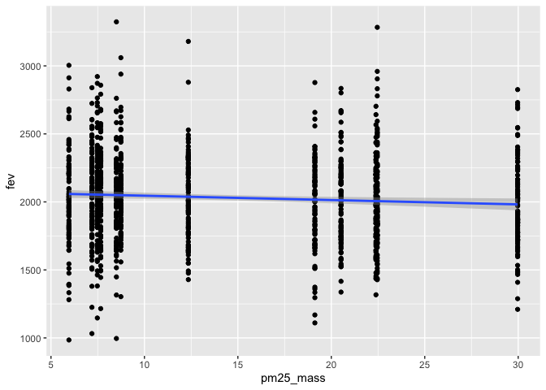

hw02
================
Kaila An
2022-10-06

``` r
library(tidyverse)
```

    ## ── Attaching packages ─────────────────────────────────────── tidyverse 1.3.2 ──
    ## ✔ ggplot2 3.3.6     ✔ purrr   0.3.4
    ## ✔ tibble  3.1.8     ✔ dplyr   1.0.9
    ## ✔ tidyr   1.2.0     ✔ stringr 1.4.1
    ## ✔ readr   2.1.2     ✔ forcats 0.5.2
    ## ── Conflicts ────────────────────────────────────────── tidyverse_conflicts() ──
    ## ✖ dplyr::filter() masks stats::filter()
    ## ✖ dplyr::lag()    masks stats::lag()

``` r
library(data.table)
```

    ## 
    ## Attaching package: 'data.table'
    ## 
    ## The following objects are masked from 'package:dplyr':
    ## 
    ##     between, first, last
    ## 
    ## The following object is masked from 'package:purrr':
    ## 
    ##     transpose

``` r
library(dplyr)
library(dtplyr)
library(ggplot2)
```

## Data Wrangling

Read in the data.

``` r
chsind <- data.table::fread("chs_individual.csv")
chsreg <- data.table::fread("chs_regional.csv")
```

Merge the data sets.

``` r
chs <- merge(chsind, chsreg, by="townname")
```

\#1. After merging the data, make sure you don’t have any duplicates by
counting the number of rows. Make sure it matches.

``` r
nrow(chsind)
```

    ## [1] 1200

``` r
nrow(chs)
```

    ## [1] 1200

There is no repeat data. The merged set and the original individual set
both have 1200 rows.

Imputation step for missing values.

``` r
chs[ , bmi_imp := fcoalesce(bmi, mean(bmi, na.rm = TRUE)),
by = . (hispanic, male)]
```

\#2. Create a new categorical variable named “obesity_level” using the
BMI measurement (underweight BMI\<14; normal BMI 14-22; overweight BMI
22-24; obese BMI\>24). To make sure the variable is rightly coded,
create a summary table that contains the minimum BMI, maximum BMI, and
the total number of observations per category.

``` r
chs$obesity_level <- as.factor (ifelse(chs$bmi < 14, 'underweight',
                                ifelse(chs$bmi < 22, 'normal', 
                                ifelse(chs$bmi < 24, 'overweight','obese' ))))
```

``` r
chs[, .(
  minimum = min(bmi),
  maximum = max(bmi),
  count   = .N
), by = c("obesity_level")]
```

    ##    obesity_level  minimum  maximum count
    ## 1:        normal 14.00380 21.96387   886
    ## 2:    overweight 22.02353 23.99650    87
    ## 3:         obese 24.00647 41.26613   103
    ## 4:          <NA>       NA       NA    89
    ## 5:   underweight 11.29640 13.98601    35

\#3. Create another categorical variable named “smoke_gas_exposure” that
summarizes “Second Hand Smoke” and “Gas Stove.” The variable should have
four categories in total.

``` r
chs[ , smoke_gas_exposure := ifelse(smoke == 0 & gasstove == 0, "Neither",
                             ifelse(smoke == 1 & gasstove == 0, "smoke_only",
                             ifelse(smoke == 0 & gasstove == 1, "gas_only",
                             ifelse(smoke == 1 & gasstove == 1, "both", NA_character_))))]

chs[ ,.(total = length(smoke)), by = smoke_gas_exposure]
```

    ##    smoke_gas_exposure total
    ## 1:            Neither   214
    ## 2:               <NA>    60
    ## 3:         smoke_only    36
    ## 4:           gas_only   739
    ## 5:               both   151

\#4. Create four summary tables showing the average (or proportion, if
binary) and sd of “Forced expiratory volume in 1 second (ml)” and asthma
indicator by town, sex, obesity level, and “smoke_gas_exposure.”

``` r
chs[,.(
   mean = mean(fev, na.rm=TRUE),
   sd   = sd(fev, na.rm=TRUE)
), by   = townname][order(townname)]
```

    ##          townname     mean       sd
    ##  1:        Alpine 2089.014 298.2039
    ##  2:    Atascadero 2079.374 331.8782
    ##  3: Lake Elsinore 2039.787 317.6112
    ##  4:  Lake Gregory 2091.665 337.8286
    ##  5:     Lancaster 2002.550 337.1053
    ##  6:        Lompoc 2038.227 367.4474
    ##  7:    Long Beach 1983.896 330.6271
    ##  8:     Mira Loma 1984.726 336.6416
    ##  9:     Riverside 1986.212 289.7415
    ## 10:     San Dimas 2027.806 321.9740
    ## 11:   Santa Maria 2022.553 330.0457
    ## 12:        Upland 2027.284 357.2010

``` r
chs[,.(
   mean = mean(fev, na.rm=TRUE),
   sd   = sd(fev, na.rm=TRUE)
), by   = male][order(male)]
```

    ##    male     mean       sd
    ## 1:    0 1959.105 327.2948
    ## 2:    1 2103.819 318.2036

``` r
chs[,.(
   mean = mean(fev, na.rm=TRUE),
   sd   = sd(fev, na.rm=TRUE)
), by   = obesity_level][order(obesity_level)]
```

    ##    obesity_level     mean       sd
    ## 1:        normal 1997.974 309.4085
    ## 2:         obese 2269.295 325.5054
    ## 3:    overweight 2224.322 317.4261
    ## 4:   underweight 1686.800 300.0803
    ## 5:          <NA>      NaN       NA

``` r
chs[,.(
   mean = mean(fev, na.rm=TRUE),
   sd   = sd(fev, na.rm=TRUE)
), by   = smoke_gas_exposure][order(smoke_gas_exposure)]
```

    ##    smoke_gas_exposure     mean       sd
    ## 1:            Neither 2059.943 342.5625
    ## 2:               both 2019.974 313.2327
    ## 3:           gas_only 2026.308 328.1240
    ## 4:         smoke_only 2064.346 333.2266
    ## 5:               <NA> 1999.783 364.9553

## Looking at the Data (EDA)

Follow the EDA checklist from week 3 and the previous assignment. Be
sure to focus on the key variables. Visualization Create the following
figures and interpret them. Be sure to include easily understandable
axes, titles, and legends.

# EDA Checklist

For each of the two datasets, check the dimensions, headers, footers,
variable names and variable types.

``` r
dim(chsind)
```

    ## [1] 1200   23

``` r
dim(chsreg)
```

    ## [1] 12 27

``` r
dim(chs)
```

    ## [1] 1200   52

``` r
head(chsind)
```

    ##    sid  townname male race hispanic    agepft height weight      bmi asthma
    ## 1:   1 Lancaster    1    W        0 10.154689    123     54 16.22411      0
    ## 2:   2 Lancaster    1    W        0 10.461328    145     77 16.64685      0
    ## 3:   6 Lancaster    0    B        0 10.097194    145    143 30.91558      0
    ## 4:   7 Lancaster    0    O        0 10.746064    156     72 13.44809      0
    ## 5:   8 Lancaster    0    W        1  9.782341    132     61 15.91326      0
    ## 6:  10 Lancaster    1    O        1        NA     NA     NA       NA      0
    ##    active_asthma father_asthma mother_asthma wheeze hayfever allergy
    ## 1:             0             0             0      0        0       0
    ## 2:             0             0             0      1        0       0
    ## 3:             0             0             0      0        1       0
    ## 4:             0            NA             0      1        0       0
    ## 5:             0             1             0      1        1       1
    ## 6:             1             1             0      0        0       0
    ##    educ_parent smoke pets gasstove      fev      fvc     mmef
    ## 1:           3     0    1        1 1650.254 1800.005 2537.777
    ## 2:           5     0    1        0 2273.129 2721.111 2365.745
    ## 3:           2     0    0        1 2011.653 2257.244 1818.973
    ## 4:           2     1    1        1 1643.092 2060.526 1462.500
    ## 5:           3     0    1        0 1651.974 1996.382 1606.579
    ## 6:           1     0    1        1       NA       NA       NA

``` r
head(chsreg)
```

    ##         townname pm25_mass pm25_so4 pm25_no3 pm25_nh4 pm25_oc pm25_ec pm25_om
    ## 1:        Alpine      8.74     1.73     1.59     0.88    2.54    0.48    3.04
    ## 2: Lake Elsinore     12.35     1.90     2.98     1.36    3.64    0.62    4.36
    ## 3:  Lake Gregory      7.66     1.07     2.07     0.91    2.46    0.40    2.96
    ## 4:     Lancaster      8.50     0.91     1.87     0.78    4.43    0.55    5.32
    ## 5:        Lompoc      5.96     1.08     0.73     0.41    1.45    0.13    1.74
    ## 6:    Long Beach     19.12     3.23     6.22     2.57    5.21    1.36    6.25
    ##    pm10_oc pm10_ec pm10_tc formic acetic  hcl hno3 o3_max o3106 o3_24   no2
    ## 1:    3.25    0.49    3.75   1.03   2.49 0.41 1.98  65.82 55.05 41.23 12.18
    ## 2:    4.66    0.63    5.29   1.18   3.56 0.46 2.63  66.70 54.42 32.23 17.03
    ## 3:    3.16    0.41    3.57   0.66   2.36 0.28 2.28  84.44 67.01 57.76  7.62
    ## 4:    5.68    0.56    8.61   0.88   2.88 0.22 1.80  54.81 43.88 32.86 15.77
    ## 5:    1.86    0.14    1.99   0.34   0.75 0.33 0.43  43.85 37.74 28.37  4.60
    ## 6:    6.68    1.39    8.07   1.57   2.94 0.73 2.67  39.44 28.22 18.22 33.11
    ##     pm10 no_24hr pm2_5_fr iacid oacid total_acids       lon      lat
    ## 1: 24.73    2.48    10.28  2.39  3.52        5.50 -116.7664 32.83505
    ## 2: 34.25    7.07    14.53  3.09  4.74        7.37 -117.3273 33.66808
    ## 3: 20.05      NA     9.01  2.56  3.02        5.30 -117.2752 34.24290
    ## 4: 25.04   12.68       NA  2.02  3.76        5.56 -118.1542 34.68678
    ## 5: 18.40    2.05       NA  0.76  1.09        1.52 -120.4579 34.63915
    ## 6: 38.41   36.76    22.23  3.40  4.51        7.18 -118.1937 33.77005

``` r
head(chs)
```

    ##    townname sid male race hispanic    agepft height weight      bmi asthma
    ## 1:   Alpine 835    0    W        0 10.099932    143     69 15.33749      0
    ## 2:   Alpine 838    0    O        1  9.486653    133     62 15.93183      0
    ## 3:   Alpine 839    0    M        1 10.053388    142     86 19.38649      0
    ## 4:   Alpine 840    0    W        0  9.965777    146     78 16.63283      0
    ## 5:   Alpine 841    1    W        1 10.548939    150     78 15.75758      0
    ## 6:   Alpine 842    1    M        1  9.489391    139     65 15.29189      0
    ##    active_asthma father_asthma mother_asthma wheeze hayfever allergy
    ## 1:             0             0             0      0        0       1
    ## 2:             0             0             0      0        0       0
    ## 3:             0             0             1      1        1       1
    ## 4:             0             0             0      0        0       0
    ## 5:             0             0             0      0        0       0
    ## 6:             0             0             0      1        0       0
    ##    educ_parent smoke pets gasstove      fev      fvc     mmef pm25_mass
    ## 1:           3     0    1        0 2529.276 2826.316 3406.579      8.74
    ## 2:           4    NA    1        0 1737.793 1963.545 2133.110      8.74
    ## 3:           3     1    1        0 2121.711 2326.974 2835.197      8.74
    ## 4:          NA    NA    0       NA 2466.791 2638.221 3466.464      8.74
    ## 5:           5     0    1        0 2251.505 2594.649 2445.151      8.74
    ## 6:           1     1    1        0 2188.716 2423.934 2524.599      8.74
    ##    pm25_so4 pm25_no3 pm25_nh4 pm25_oc pm25_ec pm25_om pm10_oc pm10_ec pm10_tc
    ## 1:     1.73     1.59     0.88    2.54    0.48    3.04    3.25    0.49    3.75
    ## 2:     1.73     1.59     0.88    2.54    0.48    3.04    3.25    0.49    3.75
    ## 3:     1.73     1.59     0.88    2.54    0.48    3.04    3.25    0.49    3.75
    ## 4:     1.73     1.59     0.88    2.54    0.48    3.04    3.25    0.49    3.75
    ## 5:     1.73     1.59     0.88    2.54    0.48    3.04    3.25    0.49    3.75
    ## 6:     1.73     1.59     0.88    2.54    0.48    3.04    3.25    0.49    3.75
    ##    formic acetic  hcl hno3 o3_max o3106 o3_24   no2  pm10 no_24hr pm2_5_fr
    ## 1:   1.03   2.49 0.41 1.98  65.82 55.05 41.23 12.18 24.73    2.48    10.28
    ## 2:   1.03   2.49 0.41 1.98  65.82 55.05 41.23 12.18 24.73    2.48    10.28
    ## 3:   1.03   2.49 0.41 1.98  65.82 55.05 41.23 12.18 24.73    2.48    10.28
    ## 4:   1.03   2.49 0.41 1.98  65.82 55.05 41.23 12.18 24.73    2.48    10.28
    ## 5:   1.03   2.49 0.41 1.98  65.82 55.05 41.23 12.18 24.73    2.48    10.28
    ## 6:   1.03   2.49 0.41 1.98  65.82 55.05 41.23 12.18 24.73    2.48    10.28
    ##    iacid oacid total_acids       lon      lat  bmi_imp obesity_level
    ## 1:  2.39  3.52         5.5 -116.7664 32.83505 15.33749        normal
    ## 2:  2.39  3.52         5.5 -116.7664 32.83505 15.93183        normal
    ## 3:  2.39  3.52         5.5 -116.7664 32.83505 19.38649        normal
    ## 4:  2.39  3.52         5.5 -116.7664 32.83505 16.63283        normal
    ## 5:  2.39  3.52         5.5 -116.7664 32.83505 15.75758        normal
    ## 6:  2.39  3.52         5.5 -116.7664 32.83505 15.29189        normal
    ##    smoke_gas_exposure
    ## 1:            Neither
    ## 2:               <NA>
    ## 3:         smoke_only
    ## 4:               <NA>
    ## 5:            Neither
    ## 6:         smoke_only

``` r
tail(chsind)
```

    ##     sid townname male race hispanic   agepft height weight      bmi asthma
    ## 1: 2046   Lompoc    0    O        1 9.470226    142    106 23.89497      0
    ## 2: 2047   Lompoc    0    W        1 9.631759    136     68 16.71123      0
    ## 3: 2048   Lompoc    0    O        1 9.472964    133     68 17.47362      0
    ## 4: 2049   Lompoc    1    O        1 9.733060    141    104 23.77784      0
    ## 5: 2050   Lompoc    0    O        1 9.875428    145    119 25.72695      0
    ## 6: 2053   Upland    0    W        0       NA     NA     NA       NA      0
    ##    active_asthma father_asthma mother_asthma wheeze hayfever allergy
    ## 1:             0             0             0      0        0       0
    ## 2:             0             0             0      0       NA       0
    ## 3:             0             0             0      0        0      NA
    ## 4:             0             1             1      0        0       0
    ## 5:             0             0             0      0        0       0
    ## 6:             0             0             0      0        0       0
    ##    educ_parent smoke pets gasstove       fev      fvc      mmef
    ## 1:          NA     0    0        1 2258.8816 2468.092 2935.8553
    ## 2:           2     0    0        1  984.8485 1352.525  757.5758
    ## 3:           1     0    0        1 1737.8289 1883.882 2689.1447
    ## 4:           5     0    1        1 2260.3078 2930.661 1831.1609
    ## 5:           1     0    0        1 2615.9708 2937.370 3651.8116
    ## 6:           3     0    1        0        NA       NA        NA

``` r
tail(chsreg)
```

    ##       townname pm25_mass pm25_so4 pm25_no3 pm25_nh4 pm25_oc pm25_ec pm25_om
    ## 1:   Mira Loma     29.97     2.69    12.20     4.25   11.83    1.25   14.20
    ## 2:   Riverside     22.39     2.43     8.66     3.14    5.27    0.94    6.32
    ## 3:   San Dimas     20.52     2.59     7.20     2.71    5.59    1.17    6.71
    ## 4:  Atascadero      7.48     0.79     1.38     0.61    3.31    0.40    3.97
    ## 5: Santa Maria      7.19     1.44     1.21     0.59    2.39    0.34    2.86
    ## 6:      Upland     22.46     2.65     7.75     2.96    6.49    1.19    7.79
    ##    pm10_oc pm10_ec pm10_tc formic acetic  hcl hno3 o3_max o3106 o3_24   no2
    ## 1:   15.16    1.28   16.44   1.90   5.14 0.46 3.33  70.65 55.81 26.81 19.62
    ## 2:    6.75    0.96    7.72   1.72   3.92 0.47 3.43  77.90 62.04 31.50 19.95
    ## 3:    7.17    1.19    8.37   2.77   4.24 0.55 4.07  64.26 46.99 21.63 35.47
    ## 4:    4.24    0.41    4.65   0.74   2.11 0.31 0.97  51.96 43.29 26.21 12.56
    ## 5:    3.06    0.35    3.41   0.52   1.00 0.37 0.78  38.27 32.17 23.68 11.95
    ## 6:    8.32    1.22    9.54   2.67   4.73 0.46 4.03  63.83 46.50 22.20 37.97
    ##     pm10 no_24hr pm2_5_fr iacid oacid total_acids       lon      lat
    ## 1: 70.39   26.90    31.55  3.79  7.04       10.37 -117.5159 33.98454
    ## 2: 41.55   15.48    27.99  3.90  5.64        9.07 -117.3755 33.98060
    ## 3: 38.61   42.95    25.33  4.62  7.01       11.08 -117.8067 34.10668
    ## 4: 20.93    8.71       NA  1.28  2.85        3.82 -120.6707 35.48942
    ## 5: 18.52    4.74     9.46  1.15  1.52        2.30 -120.4357 34.95303
    ## 6: 40.80   18.48    27.73  4.49  7.40       11.43 -117.6484 34.09751

``` r
tail(chs)
```

    ##    townname  sid male race hispanic    agepft height weight      bmi asthma
    ## 1:   Upland 1866    0    O        1  9.806982    139     60 14.11559      0
    ## 2:   Upland 1867    0    M        1  9.618070    140     71 16.46568      0
    ## 3:   Upland 2031    1    W        0  9.798768    135     83 20.70084      0
    ## 4:   Upland 2032    1    W        0  9.549624    137     59 14.28855      0
    ## 5:   Upland 2033    0    M        0 10.121834    130     67 18.02044      0
    ## 6:   Upland 2053    0    W        0        NA     NA     NA       NA      0
    ##    active_asthma father_asthma mother_asthma wheeze hayfever allergy
    ## 1:             0            NA             0      0       NA      NA
    ## 2:             0             1             0      0        0       0
    ## 3:             0             0             0      1        0       1
    ## 4:             0             0             1      1        1       1
    ## 5:             1             0             0      1        1       0
    ## 6:             0             0             0      0        0       0
    ##    educ_parent smoke pets gasstove      fev      fvc     mmef pm25_mass
    ## 1:           3     0    1        0 1691.275 1928.859 1890.604     22.46
    ## 2:           3     0    1        0 1733.338 1993.040 2072.643     22.46
    ## 3:           3     0    1        1 2034.177 2505.535 1814.075     22.46
    ## 4:           3     0    1        1 2077.703 2275.338 2706.081     22.46
    ## 5:           3     0    1        1 1929.866 2122.148 2558.054     22.46
    ## 6:           3     0    1        0       NA       NA       NA     22.46
    ##    pm25_so4 pm25_no3 pm25_nh4 pm25_oc pm25_ec pm25_om pm10_oc pm10_ec pm10_tc
    ## 1:     2.65     7.75     2.96    6.49    1.19    7.79    8.32    1.22    9.54
    ## 2:     2.65     7.75     2.96    6.49    1.19    7.79    8.32    1.22    9.54
    ## 3:     2.65     7.75     2.96    6.49    1.19    7.79    8.32    1.22    9.54
    ## 4:     2.65     7.75     2.96    6.49    1.19    7.79    8.32    1.22    9.54
    ## 5:     2.65     7.75     2.96    6.49    1.19    7.79    8.32    1.22    9.54
    ## 6:     2.65     7.75     2.96    6.49    1.19    7.79    8.32    1.22    9.54
    ##    formic acetic  hcl hno3 o3_max o3106 o3_24   no2 pm10 no_24hr pm2_5_fr iacid
    ## 1:   2.67   4.73 0.46 4.03  63.83  46.5  22.2 37.97 40.8   18.48    27.73  4.49
    ## 2:   2.67   4.73 0.46 4.03  63.83  46.5  22.2 37.97 40.8   18.48    27.73  4.49
    ## 3:   2.67   4.73 0.46 4.03  63.83  46.5  22.2 37.97 40.8   18.48    27.73  4.49
    ## 4:   2.67   4.73 0.46 4.03  63.83  46.5  22.2 37.97 40.8   18.48    27.73  4.49
    ## 5:   2.67   4.73 0.46 4.03  63.83  46.5  22.2 37.97 40.8   18.48    27.73  4.49
    ## 6:   2.67   4.73 0.46 4.03  63.83  46.5  22.2 37.97 40.8   18.48    27.73  4.49
    ##    oacid total_acids       lon      lat  bmi_imp obesity_level
    ## 1:   7.4       11.43 -117.6484 34.09751 14.11559        normal
    ## 2:   7.4       11.43 -117.6484 34.09751 16.46568        normal
    ## 3:   7.4       11.43 -117.6484 34.09751 20.70084        normal
    ## 4:   7.4       11.43 -117.6484 34.09751 14.28855        normal
    ## 5:   7.4       11.43 -117.6484 34.09751 18.02044        normal
    ## 6:   7.4       11.43 -117.6484 34.09751 18.05281          <NA>
    ##    smoke_gas_exposure
    ## 1:            Neither
    ## 2:            Neither
    ## 3:           gas_only
    ## 4:           gas_only
    ## 5:           gas_only
    ## 6:            Neither

``` r
str(chsind)
```

    ## Classes 'data.table' and 'data.frame':   1200 obs. of  23 variables:
    ##  $ sid          : int  1 2 6 7 8 10 13 16 19 21 ...
    ##  $ townname     : chr  "Lancaster" "Lancaster" "Lancaster" "Lancaster" ...
    ##  $ male         : int  1 1 0 0 0 1 1 0 0 0 ...
    ##  $ race         : chr  "W" "W" "B" "O" ...
    ##  $ hispanic     : int  0 0 0 0 1 1 1 0 0 1 ...
    ##  $ agepft       : num  10.15 10.46 10.1 10.75 9.78 ...
    ##  $ height       : int  123 145 145 156 132 NA 140 141 NA 126 ...
    ##  $ weight       : int  54 77 143 72 61 NA 79 74 NA 59 ...
    ##  $ bmi          : num  16.2 16.6 30.9 13.4 15.9 ...
    ##  $ asthma       : int  0 0 0 0 0 0 0 1 0 0 ...
    ##  $ active_asthma: int  0 0 0 0 0 1 0 0 0 0 ...
    ##  $ father_asthma: int  0 0 0 NA 1 1 0 0 0 0 ...
    ##  $ mother_asthma: int  0 0 0 0 0 0 0 1 0 0 ...
    ##  $ wheeze       : int  0 1 0 1 1 0 0 1 0 0 ...
    ##  $ hayfever     : int  0 0 1 0 1 0 0 0 0 0 ...
    ##  $ allergy      : int  0 0 0 0 1 0 0 1 0 1 ...
    ##  $ educ_parent  : int  3 5 2 2 3 1 3 3 3 3 ...
    ##  $ smoke        : int  0 0 0 1 0 0 0 1 0 0 ...
    ##  $ pets         : int  1 1 0 1 1 1 1 1 1 1 ...
    ##  $ gasstove     : int  1 0 1 1 0 1 0 1 1 1 ...
    ##  $ fev          : num  1650 2273 2012 1643 1652 ...
    ##  $ fvc          : num  1800 2721 2257 2061 1996 ...
    ##  $ mmef         : num  2538 2366 1819 1462 1607 ...
    ##  - attr(*, ".internal.selfref")=<externalptr>

``` r
str(chsreg)
```

    ## Classes 'data.table' and 'data.frame':   12 obs. of  27 variables:
    ##  $ townname   : chr  "Alpine" "Lake Elsinore" "Lake Gregory" "Lancaster" ...
    ##  $ pm25_mass  : num  8.74 12.35 7.66 8.5 5.96 ...
    ##  $ pm25_so4   : num  1.73 1.9 1.07 0.91 1.08 3.23 2.69 2.43 2.59 0.79 ...
    ##  $ pm25_no3   : num  1.59 2.98 2.07 1.87 0.73 6.22 12.2 8.66 7.2 1.38 ...
    ##  $ pm25_nh4   : num  0.88 1.36 0.91 0.78 0.41 2.57 4.25 3.14 2.71 0.61 ...
    ##  $ pm25_oc    : num  2.54 3.64 2.46 4.43 1.45 ...
    ##  $ pm25_ec    : num  0.48 0.62 0.4 0.55 0.13 1.36 1.25 0.94 1.17 0.4 ...
    ##  $ pm25_om    : num  3.04 4.36 2.96 5.32 1.74 6.25 14.2 6.32 6.71 3.97 ...
    ##  $ pm10_oc    : num  3.25 4.66 3.16 5.68 1.86 ...
    ##  $ pm10_ec    : num  0.49 0.63 0.41 0.56 0.14 1.39 1.28 0.96 1.19 0.41 ...
    ##  $ pm10_tc    : num  3.75 5.29 3.57 8.61 1.99 ...
    ##  $ formic     : num  1.03 1.18 0.66 0.88 0.34 1.57 1.9 1.72 2.77 0.74 ...
    ##  $ acetic     : num  2.49 3.56 2.36 2.88 0.75 2.94 5.14 3.92 4.24 2.11 ...
    ##  $ hcl        : num  0.41 0.46 0.28 0.22 0.33 0.73 0.46 0.47 0.55 0.31 ...
    ##  $ hno3       : num  1.98 2.63 2.28 1.8 0.43 2.67 3.33 3.43 4.07 0.97 ...
    ##  $ o3_max     : num  65.8 66.7 84.4 54.8 43.9 ...
    ##  $ o3106      : num  55 54.4 67 43.9 37.7 ...
    ##  $ o3_24      : num  41.2 32.2 57.8 32.9 28.4 ...
    ##  $ no2        : num  12.18 17.03 7.62 15.77 4.6 ...
    ##  $ pm10       : num  24.7 34.2 20.1 25 18.4 ...
    ##  $ no_24hr    : num  2.48 7.07 NA 12.68 2.05 ...
    ##  $ pm2_5_fr   : num  10.28 14.53 9.01 NA NA ...
    ##  $ iacid      : num  2.39 3.09 2.56 2.02 0.76 3.4 3.79 3.9 4.62 1.28 ...
    ##  $ oacid      : num  3.52 4.74 3.02 3.76 1.09 4.51 7.04 5.64 7.01 2.85 ...
    ##  $ total_acids: num  5.5 7.37 5.3 5.56 1.52 ...
    ##  $ lon        : num  -117 -117 -117 -118 -120 ...
    ##  $ lat        : num  32.8 33.7 34.2 34.7 34.6 ...
    ##  - attr(*, ".internal.selfref")=<externalptr>

``` r
str(chs)
```

    ## Classes 'data.table' and 'data.frame':   1200 obs. of  52 variables:
    ##  $ townname          : chr  "Alpine" "Alpine" "Alpine" "Alpine" ...
    ##  $ sid               : int  835 838 839 840 841 842 843 844 847 849 ...
    ##  $ male              : int  0 0 0 0 1 1 1 1 1 1 ...
    ##  $ race              : chr  "W" "O" "M" "W" ...
    ##  $ hispanic          : int  0 1 1 0 1 1 0 1 0 0 ...
    ##  $ agepft            : num  10.1 9.49 10.05 9.97 10.55 ...
    ##  $ height            : int  143 133 142 146 150 139 149 143 137 147 ...
    ##  $ weight            : int  69 62 86 78 78 65 98 65 69 112 ...
    ##  $ bmi               : num  15.3 15.9 19.4 16.6 15.8 ...
    ##  $ asthma            : int  0 0 0 0 0 0 0 NA 0 0 ...
    ##  $ active_asthma     : int  0 0 0 0 0 0 0 0 0 0 ...
    ##  $ father_asthma     : int  0 0 0 0 0 0 0 NA 0 1 ...
    ##  $ mother_asthma     : int  0 0 1 0 0 0 0 NA 0 0 ...
    ##  $ wheeze            : int  0 0 1 0 0 1 1 NA 0 1 ...
    ##  $ hayfever          : int  0 0 1 0 0 0 0 NA 0 0 ...
    ##  $ allergy           : int  1 0 1 0 0 0 1 NA 0 1 ...
    ##  $ educ_parent       : int  3 4 3 NA 5 1 3 NA 5 3 ...
    ##  $ smoke             : int  0 NA 1 NA 0 1 0 NA 0 0 ...
    ##  $ pets              : int  1 1 1 0 1 1 1 0 1 1 ...
    ##  $ gasstove          : int  0 0 0 NA 0 0 1 NA 1 0 ...
    ##  $ fev               : num  2529 1738 2122 2467 2252 ...
    ##  $ fvc               : num  2826 1964 2327 2638 2595 ...
    ##  $ mmef              : num  3407 2133 2835 3466 2445 ...
    ##  $ pm25_mass         : num  8.74 8.74 8.74 8.74 8.74 8.74 8.74 8.74 8.74 8.74 ...
    ##  $ pm25_so4          : num  1.73 1.73 1.73 1.73 1.73 1.73 1.73 1.73 1.73 1.73 ...
    ##  $ pm25_no3          : num  1.59 1.59 1.59 1.59 1.59 1.59 1.59 1.59 1.59 1.59 ...
    ##  $ pm25_nh4          : num  0.88 0.88 0.88 0.88 0.88 0.88 0.88 0.88 0.88 0.88 ...
    ##  $ pm25_oc           : num  2.54 2.54 2.54 2.54 2.54 2.54 2.54 2.54 2.54 2.54 ...
    ##  $ pm25_ec           : num  0.48 0.48 0.48 0.48 0.48 0.48 0.48 0.48 0.48 0.48 ...
    ##  $ pm25_om           : num  3.04 3.04 3.04 3.04 3.04 3.04 3.04 3.04 3.04 3.04 ...
    ##  $ pm10_oc           : num  3.25 3.25 3.25 3.25 3.25 3.25 3.25 3.25 3.25 3.25 ...
    ##  $ pm10_ec           : num  0.49 0.49 0.49 0.49 0.49 0.49 0.49 0.49 0.49 0.49 ...
    ##  $ pm10_tc           : num  3.75 3.75 3.75 3.75 3.75 3.75 3.75 3.75 3.75 3.75 ...
    ##  $ formic            : num  1.03 1.03 1.03 1.03 1.03 1.03 1.03 1.03 1.03 1.03 ...
    ##  $ acetic            : num  2.49 2.49 2.49 2.49 2.49 2.49 2.49 2.49 2.49 2.49 ...
    ##  $ hcl               : num  0.41 0.41 0.41 0.41 0.41 0.41 0.41 0.41 0.41 0.41 ...
    ##  $ hno3              : num  1.98 1.98 1.98 1.98 1.98 1.98 1.98 1.98 1.98 1.98 ...
    ##  $ o3_max            : num  65.8 65.8 65.8 65.8 65.8 ...
    ##  $ o3106             : num  55 55 55 55 55 ...
    ##  $ o3_24             : num  41.2 41.2 41.2 41.2 41.2 ...
    ##  $ no2               : num  12.2 12.2 12.2 12.2 12.2 ...
    ##  $ pm10              : num  24.7 24.7 24.7 24.7 24.7 ...
    ##  $ no_24hr           : num  2.48 2.48 2.48 2.48 2.48 2.48 2.48 2.48 2.48 2.48 ...
    ##  $ pm2_5_fr          : num  10.3 10.3 10.3 10.3 10.3 ...
    ##  $ iacid             : num  2.39 2.39 2.39 2.39 2.39 2.39 2.39 2.39 2.39 2.39 ...
    ##  $ oacid             : num  3.52 3.52 3.52 3.52 3.52 3.52 3.52 3.52 3.52 3.52 ...
    ##  $ total_acids       : num  5.5 5.5 5.5 5.5 5.5 5.5 5.5 5.5 5.5 5.5 ...
    ##  $ lon               : num  -117 -117 -117 -117 -117 ...
    ##  $ lat               : num  32.8 32.8 32.8 32.8 32.8 ...
    ##  $ bmi_imp           : num  15.3 15.9 19.4 16.6 15.8 ...
    ##  $ obesity_level     : Factor w/ 4 levels "normal","obese",..: 1 1 1 1 1 1 1 1 1 3 ...
    ##  $ smoke_gas_exposure: chr  "Neither" NA "smoke_only" NA ...
    ##  - attr(*, ".internal.selfref")=<externalptr> 
    ##  - attr(*, "sorted")= chr "townname"

Check for any data issues, particularly in the key variable we are
analyzing.

``` r
summary(chs$obesity_level)
```

    ##      normal       obese  overweight underweight        NA's 
    ##         886         103          87          35          89

``` r
summary(chs$bmi)
```

    ##    Min. 1st Qu.  Median    Mean 3rd Qu.    Max.    NA's 
    ##   11.30   15.78   17.48   18.50   20.35   41.27      89

``` r
summary(chs$pm25_mass)
```

    ##    Min. 1st Qu.  Median    Mean 3rd Qu.    Max. 
    ##   5.960   7.615  10.545  14.362  20.988  29.970

``` r
summary(chs$fev)
```

    ##    Min. 1st Qu.  Median    Mean 3rd Qu.    Max.    NA's 
    ##   984.8  1809.0  2022.7  2031.3  2249.7  3323.7      95

``` r
summary(chs$smoke_gas_exposure)
```

    ##    Length     Class      Mode 
    ##      1200 character character

\#1. Facet plot showing scatterplots with regression lines of BMI vs FEV
by “townname”.

``` r
chs[!is.na(townname)]%>%
  ggplot(data = chs, mapping = aes(x = bmi, y = fev, color = townname)) +
  geom_point() +
  facet_wrap(~townname, nrow = 3) +
  geom_smooth(method = 'lm', formula = y~x)
```

    ## Warning: Removed 95 rows containing non-finite values (stat_smooth).

    ## Warning: Removed 95 rows containing missing values (geom_point).

<!-- -->

In the different towns, we can see that BMI and FEV are consistently
positively correlated. Increased BMI results in increased FEV.

\#2. Stacked histograms of FEV by BMI category and FEV by smoke/gas
exposure. Use different color schemes than the ggplot default.

``` r
ggplot(data = chs) + 
  geom_histogram(mapping = aes(x = fev, fill = obesity_level), binwidth = 50) + scale_fill_brewer(palette = "RdPu")
```

    ## Warning: Removed 95 rows containing non-finite values (stat_bin).

<!-- -->

Higher weight (being in the overweight to obese weight category) results
in higher FEV levels while those who are underweight experience lower
FEV levels.

``` r
ggplot(data = chs) + 
  geom_histogram(mapping = aes(x = fev, fill = smoke_gas_exposure), binwidth = 50) + scale_fill_brewer(palette = "OrRd")
```

    ## Warning: Removed 95 rows containing non-finite values (stat_bin).

<!-- -->

There are no major notable differences between the different categories
for smoke/gas exposure. If anything, it can be important to note that
majority have gas_only or both.

\#3. Barchart of BMI by smoke/gas exposure.

``` r
chs[!is.na(smoke_gas_exposure)] %>%
  ggplot() + 
  geom_bar(mapping = aes(x = bmi, colour = smoke_gas_exposure, fill = smoke_gas_exposure, binwidth = 100)) + 
  scale_fill_brewer(palette = "BuPu")
```

    ## Warning: Ignoring unknown aesthetics: binwidth

    ## Warning: Removed 81 rows containing non-finite values (stat_count).

<!-- -->

Higher counts of gas_only and lower BMI are affiliated.

``` r
chs[!is.na(smoke_gas_exposure)] %>%
  ggplot() + 
  geom_bar(mapping = aes(x = obesity_level, colour = smoke_gas_exposure, fill = smoke_gas_exposure, binwidth = 50)) + 
  scale_fill_brewer(palette = "BuPu")
```

    ## Warning: Ignoring unknown aesthetics: binwidth

<!-- -->

There is no great difference between the distribution of the different
categories for each of the obesity level groups. Most seem to fall into
the normal cateogry, which is why the bar is much larger there.

\#4. Statistical summary graphs of FEV by BMI and FEV by smoke/gas
exposure category.

``` r
chs[!is.na(bmi)] %>% 
  ggplot()+
  geom_boxplot(mapping=aes(x=bmi, y=fev, fill=bmi))
```

    ## Warning: Continuous x aesthetic -- did you forget aes(group=...)?

    ## Warning: Removed 6 rows containing non-finite values (stat_boxplot).

<!-- -->
Greater BMI is affiliated with greater levels of FEV, and lower BMI is
affiliated with lower levels of FEV.

``` r
chs[!is.na(obesity_level)] %>% 
  ggplot() +
  geom_boxplot(mapping = aes(x = obesity_level, y = fev, fill = obesity_level)) +
  scale_fill_brewer(palette = "Blues")
```

    ## Warning: Removed 6 rows containing non-finite values (stat_boxplot).

<!-- -->

Those of lower BMI and therefore, those who are underweight experience
lower FEV. Those of higher BMI (obese and overweight) experience higher
levels of FEV.

``` r
chs[!is.na(bmi)] %>% 
  ggplot() +
  geom_boxplot(mapping = aes(x = smoke_gas_exposure, y = fev, fill = smoke_gas_exposure)) +   scale_fill_brewer(palette = "Blues")
```

    ## Warning: Removed 6 rows containing non-finite values (stat_boxplot).

<!-- -->

There are no major differences between the different categories. If
anything, smoke_only is affiliated with slightly lower FEV levels and
gas only is affiliated with very slightly higher FEV levels.

\#5. A leaflet map showing the concentrations of PM2.5 mass in each of
the CHS communities.

``` r
library(leaflet)
tem.pal <- colorFactor(topo.colors(2), domain = chs$pm25_mass)
leaflet(chs) %>% 
  # the looks of the map
  addTiles() %>%
  # some circles
  addCircles (color = ~tem.pal(pm25_mass),
               label = ~pm25_mass, 
               opacity=0.01, fillOpacity = 0.01, radius = 500) %>%
  # add a pretty legend
  addLegend('bottomleft', pal= tem.pal, values = chs$pm25_mass,
             title ='pm25_mass levels in CHS communities', opacity=1)
```

    ## Assuming "lon" and "lat" are longitude and latitude, respectively

<!-- -->

PM25_mass levels seem to be lower in concentration near Santa Maria and
Santa Barbara and at highest concentration in Riverside.

\#6. Choose a visualization to examine whether PM2.5 mass is associated
with FEV.

``` r
chs[!is.na(townname)]%>%
  ggplot(data = chs, mapping = aes(x = pm25_mass, y = fev)) +
  geom_point() +
  geom_smooth(method = 'lm', formula = y~x)
```

    ## Warning: Removed 95 rows containing non-finite values (stat_smooth).

    ## Warning: Removed 95 rows containing missing values (geom_point).

<!-- -->

Greater PM25_mass results in lower FEV levels.

## Primary Questions of Interest

\#1. What is the association between BMI and FEV (forced expiratory
volume)?

The association between BMI and FEV is that higher BMI tends to indicate
higher levels of forced expiratory volume. Lower BMI (underweight) tends
to indicate lower levels or forced expiratory volume.

\#2. What is the association between smoke and gas exposure and FEV?

The association between smoke and gas exposure and FEV is not too
noticeable/notable. Having smoke_only resulted in slightly lower FEV
levels, but the difference is extremely small. On the other hand, having
gas_only led to the highest fev_levels, but this difference was also
very small.

\#3. What is the association between PM2.5 exposure and FEV?

Greater/higher levels of PM2.5 mass exposure result in lower forced
expiratory volume levels.
