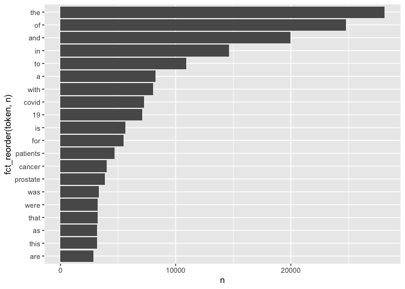
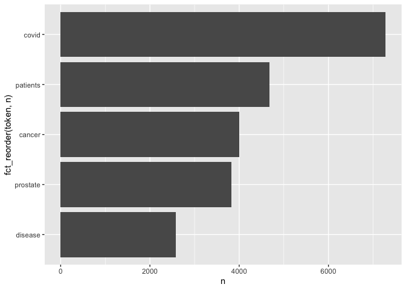

hw03
================
Kaila An
2022-11-03

``` r
library(dtplyr)
library(forcats)
library(rvest)
library(httr)
library(ggplot2)
library(tidyverse)
```

    ## ── Attaching packages ─────────────────────────────────────── tidyverse 1.3.2 ──
    ## ✔ tibble  3.1.8     ✔ purrr   0.3.4
    ## ✔ tidyr   1.2.0     ✔ dplyr   1.0.9
    ## ✔ readr   2.1.2     ✔ stringr 1.4.1
    ## ── Conflicts ────────────────────────────────────────── tidyverse_conflicts() ──
    ## ✖ dplyr::filter()         masks stats::filter()
    ## ✖ readr::guess_encoding() masks rvest::guess_encoding()
    ## ✖ dplyr::lag()            masks stats::lag()

``` r
library(tidytext)
library(stringr)
```

# APIs

## Using the NCBI API, look for papers that show up under the term “sars-cov-2 trial vaccine.” Look for the data in the pubmed database, and then retrieve the details of the paper as shown in lab 7. How many papers were you able to find?

``` r
# Downloading the website
website <- xml2::read_html("https://pubmed.ncbi.nlm.nih.gov/?term=sars-cov-2+trial+vaccine")

# Finding the counts
counts <- xml2::xml_find_first(website, "/html/body/main/div[9]/div[2]/div[2]/div[1]/div[1]")

# Turning it into text
counts <- as.character(counts)

# Extracting the data using regex
stringr::str_extract(counts, "[0-9,]+")
```

    ## [1] "4,006"

I found 4,006 papers in the database.

Details:

``` r
query_ids <- GET(
  url   = "https://eutils.ncbi.nlm.nih.gov/entrez/eutils/esearch.fcgi",
  query = list(
    db      = "pubmed",
    term    = "sars-cov-2 trial vaccine",
    retmax  = 250
  ), 
)
# Extracting the content of the response of GET
ids <- httr::content(query_ids)
```

``` r
# Turn the result into a character vector
ids <- as.character(ids)
# Find all the ids 
ids <- stringr::str_extract_all(ids, "<Id>[[:digit:]]+</Id>")[[1]]
# Remove all the leading and trailing <Id> </Id>. Make use of "|"
ids <- stringr::str_remove_all(ids, "</?Id>")
head(ids)
```

    ## [1] "36322837" "36320825" "36314847" "36307830" "36305195" "36301821"

## Using the list of pubmed ids you retrieved, download each papers’ details using the query parameter rettype = abstract. If you get more than 250 ids, just keep the first 250.

``` r
publications <- GET(
  url        = "https://eutils.ncbi.nlm.nih.gov/entrez/eutils/efetch.fcgi",
  query      = list(
  db         = "pubmed",
  id         = paste(ids[250],collapse = ","),
  retmax     = 250,
  rettype    = "abstract"
    )
)
# Turning the output into character vector
publications     <- httr::content(publications)
publications_txt  <- as.character(publications)
```

## As we did in lab 7. Create a dataset containing the following:

Pubmed ID number, Title of the paper, Name of the journal where it was
published, Publication date, and Abstract of the paper (if any).

``` r
pub_char_list <- xml2::xml_children(publications)
pub_char_list <- sapply(pub_char_list, as.character)
```

``` r
abstracts <- str_extract(pub_char_list, "<Abstract>[[:print:][:space:]]+</Abstract>")
abstracts[[1]]
```

    ## [1] "<Abstract>\n        <AbstractText Label=\"Background\" NlmCategory=\"UNASSIGNED\">The main objective of the present study was to analyze both clinical characteristics and evolution during hospitalization of a cohort of patients admitted for COVID-19 pneumonia who were not vaccinated, or with a complete or incomplete vaccination schedule.</AbstractText>\n        <AbstractText Label=\"Methods\" NlmCategory=\"UNASSIGNED\">This COVID-19 specialized single-center cohort study of 1888 COVID-19 patients hospitalized at the \"Enfermera Isabel Zendal\" Emergencies Hospital (HEEIZ), Madrid (Spain) was performed between July 1 and September 30, 2021. It compared the results of 1327 hospitalized unvaccinated patients to 209 hospitalized fully vaccinated and 352 hospitalized partially vaccinated patients. The four different COVID-19 vaccines authorized in Spain during the time-period studied were: BNT162b2 (Pfizer); ChAdOx1 nCoV-19 (AstraZeneca), mRNA-1273 (Moderna); Ad26.COV2.S (Janssen).</AbstractText>\n        <AbstractText Label=\"Findings\" NlmCategory=\"UNASSIGNED\">Hospitalized patients' median age was 41 years (IQR 33-50) for the unvaccinated and 61 years (IQR 53-67) for the fully vaccinated ones. The main comorbidities were obesity, hypertension and diabetes mellitus. 20% of unvaccinated patients (266) required noninvasive respiratory care, as did 14% (51) of partially and 14% (30) of fully vaccinated; 6% (78) of the unvaccinated patients also needed invasive respiratory care, as did 5% (16) of partially and 11 (5%) fully vaccinated.</AbstractText>\n        <AbstractText Label=\"Interpretation\" NlmCategory=\"UNASSIGNED\">Fully vaccinated patients were 84% (95% CI: 82-86%) less likely to be admitted to hospital, and protection rose for those aged &lt;50 years. Once hospitalized, vaccinated patients displayed more protection against requiring respiratory care than unvaccinated ones, despite being older and having more comorbidities. No differences appeared for the four studied COVID-19 vaccines and complying with vaccination recommendations proved relevant.</AbstractText>\n        <AbstractText Label=\"Funding\" NlmCategory=\"UNASSIGNED\">The research was funded by the \"Plan Propio de Investigación\" Program of the Castilla-La Mancha University /European Regional Development Fund (2021-GRIN-31,039).</AbstractText>\n        <CopyrightInformation>© 2022 The Authors.</CopyrightInformation>\n      </Abstract>"

``` r
abstracts <- str_remove_all(abstracts, "</?[[:alnum:]- =\"]+>")
abstracts[[1]]
```

    ## [1] "\n        The main objective of the present study was to analyze both clinical characteristics and evolution during hospitalization of a cohort of patients admitted for COVID-19 pneumonia who were not vaccinated, or with a complete or incomplete vaccination schedule.\n        This COVID-19 specialized single-center cohort study of 1888 COVID-19 patients hospitalized at the \"Enfermera Isabel Zendal\" Emergencies Hospital (HEEIZ), Madrid (Spain) was performed between July 1 and September 30, 2021. It compared the results of 1327 hospitalized unvaccinated patients to 209 hospitalized fully vaccinated and 352 hospitalized partially vaccinated patients. The four different COVID-19 vaccines authorized in Spain during the time-period studied were: BNT162b2 (Pfizer); ChAdOx1 nCoV-19 (AstraZeneca), mRNA-1273 (Moderna); Ad26.COV2.S (Janssen).\n        Hospitalized patients' median age was 41 years (IQR 33-50) for the unvaccinated and 61 years (IQR 53-67) for the fully vaccinated ones. The main comorbidities were obesity, hypertension and diabetes mellitus. 20% of unvaccinated patients (266) required noninvasive respiratory care, as did 14% (51) of partially and 14% (30) of fully vaccinated; 6% (78) of the unvaccinated patients also needed invasive respiratory care, as did 5% (16) of partially and 11 (5%) fully vaccinated.\n        Fully vaccinated patients were 84% (95% CI: 82-86%) less likely to be admitted to hospital, and protection rose for those aged &lt;50 years. Once hospitalized, vaccinated patients displayed more protection against requiring respiratory care than unvaccinated ones, despite being older and having more comorbidities. No differences appeared for the four studied COVID-19 vaccines and complying with vaccination recommendations proved relevant.\n        The research was funded by the \"Plan Propio de Investigación\" Program of the Castilla-La Mancha University /European Regional Development Fund (2021-GRIN-31,039).\n        © 2022 The Authors.\n      "

``` r
abstracts <- str_replace_all(abstracts, "[[:space:]]+", " ")
abstracts[[1]]
```

    ## [1] " The main objective of the present study was to analyze both clinical characteristics and evolution during hospitalization of a cohort of patients admitted for COVID-19 pneumonia who were not vaccinated, or with a complete or incomplete vaccination schedule. This COVID-19 specialized single-center cohort study of 1888 COVID-19 patients hospitalized at the \"Enfermera Isabel Zendal\" Emergencies Hospital (HEEIZ), Madrid (Spain) was performed between July 1 and September 30, 2021. It compared the results of 1327 hospitalized unvaccinated patients to 209 hospitalized fully vaccinated and 352 hospitalized partially vaccinated patients. The four different COVID-19 vaccines authorized in Spain during the time-period studied were: BNT162b2 (Pfizer); ChAdOx1 nCoV-19 (AstraZeneca), mRNA-1273 (Moderna); Ad26.COV2.S (Janssen). Hospitalized patients' median age was 41 years (IQR 33-50) for the unvaccinated and 61 years (IQR 53-67) for the fully vaccinated ones. The main comorbidities were obesity, hypertension and diabetes mellitus. 20% of unvaccinated patients (266) required noninvasive respiratory care, as did 14% (51) of partially and 14% (30) of fully vaccinated; 6% (78) of the unvaccinated patients also needed invasive respiratory care, as did 5% (16) of partially and 11 (5%) fully vaccinated. Fully vaccinated patients were 84% (95% CI: 82-86%) less likely to be admitted to hospital, and protection rose for those aged &lt;50 years. Once hospitalized, vaccinated patients displayed more protection against requiring respiratory care than unvaccinated ones, despite being older and having more comorbidities. No differences appeared for the four studied COVID-19 vaccines and complying with vaccination recommendations proved relevant. The research was funded by the \"Plan Propio de Investigación\" Program of the Castilla-La Mancha University /European Regional Development Fund (2021-GRIN-31,039). © 2022 The Authors. "

``` r
titles <- str_extract(pub_char_list, "<ArticleTitle>[[:print:][:space:]]+</ArticleTitle>")
titles[[1]]
```

    ## [1] "<ArticleTitle>Clinical characteristics and respiratory care in hospitalized vaccinated SARS-CoV-2 patients.</ArticleTitle>"

``` r
titles <- str_remove_all(titles, "</?[[:alnum:]- =\"]+>")
titles[[1]]
```

    ## [1] "Clinical characteristics and respiratory care in hospitalized vaccinated SARS-CoV-2 patients."

``` r
journal <- str_extract(pub_char_list, "<Journal>[[:print:][:space:]]+</Journal>")
journal[[1]]
```

    ## [1] "<Journal>\n        <ISSN IssnType=\"Electronic\">2589-5370</ISSN>\n        <JournalIssue CitedMedium=\"Internet\">\n          <Volume>48</Volume>\n          <PubDate>\n            <Year>2022</Year>\n            <Month>Jun</Month>\n          </PubDate>\n        </JournalIssue>\n        <Title>EClinicalMedicine</Title>\n        <ISOAbbreviation>EClinicalMedicine</ISOAbbreviation>\n      </Journal>"

``` r
journal <- str_extract(journal, "<Title>[[:print:][:space:]]+</Title>")
journal[[1]]
```

    ## [1] "<Title>EClinicalMedicine</Title>"

``` r
journal <- str_remove_all(journal, "</?[[:alnum:]- =\"]+>") 
journal[[1]]
```

    ## [1] "EClinicalMedicine"

``` r
journal <- str_replace_all(journal, "[[:space:]]+", " ")
journal[[1]]
```

    ## [1] "EClinicalMedicine"

``` r
pubdate <- str_extract(pub_char_list, "<PubDate>[[:print:][:space:]]+</PubDate>")
pubdate[[1]]
```

    ## [1] "<PubDate>\n            <Year>2022</Year>\n            <Month>Jun</Month>\n          </PubDate>"

``` r
pubdate <- str_remove_all(pubdate, "</?[[:alnum:]- =\"]+>")
pubdate[[1]]
```

    ## [1] "\n            2022\n            Jun\n          "

``` r
pubdate <- str_replace_all(pubdate, "[[:space:]]+", " ")
pubdate[[1]]
```

    ## [1] " 2022 Jun "

``` r
database <- data.frame(
  PubMedId = ids,
  Titles    = titles,
  Abstracts = abstracts,
  Journal = journal,
  PubDate = pubdate
)

knitr::kable(database[1:20,])
```

| PubMedId | Titles                                                                                        | Abstracts                                                                                                                                                                                                                                                                                                                                                                                                                                                                                                                                                                                                                                                                                                                                                                                                                                                                                                                                                                                                                                                                                                                                                                                                                                                                                                                                                                                                                                                                                                                                                                                                                                                                                                                                                                                                                                                                                                                                                                                                | Journal           | PubDate  |
|:---------|:----------------------------------------------------------------------------------------------|:---------------------------------------------------------------------------------------------------------------------------------------------------------------------------------------------------------------------------------------------------------------------------------------------------------------------------------------------------------------------------------------------------------------------------------------------------------------------------------------------------------------------------------------------------------------------------------------------------------------------------------------------------------------------------------------------------------------------------------------------------------------------------------------------------------------------------------------------------------------------------------------------------------------------------------------------------------------------------------------------------------------------------------------------------------------------------------------------------------------------------------------------------------------------------------------------------------------------------------------------------------------------------------------------------------------------------------------------------------------------------------------------------------------------------------------------------------------------------------------------------------------------------------------------------------------------------------------------------------------------------------------------------------------------------------------------------------------------------------------------------------------------------------------------------------------------------------------------------------------------------------------------------------------------------------------------------------------------------------------------------------|:------------------|:---------|
| 36322837 | Clinical characteristics and respiratory care in hospitalized vaccinated SARS-CoV-2 patients. | The main objective of the present study was to analyze both clinical characteristics and evolution during hospitalization of a cohort of patients admitted for COVID-19 pneumonia who were not vaccinated, or with a complete or incomplete vaccination schedule. This COVID-19 specialized single-center cohort study of 1888 COVID-19 patients hospitalized at the “Enfermera Isabel Zendal” Emergencies Hospital (HEEIZ), Madrid (Spain) was performed between July 1 and September 30, 2021. It compared the results of 1327 hospitalized unvaccinated patients to 209 hospitalized fully vaccinated and 352 hospitalized partially vaccinated patients. The four different COVID-19 vaccines authorized in Spain during the time-period studied were: BNT162b2 (Pfizer); ChAdOx1 nCoV-19 (AstraZeneca), mRNA-1273 (Moderna); Ad26.COV2.S (Janssen). Hospitalized patients’ median age was 41 years (IQR 33-50) for the unvaccinated and 61 years (IQR 53-67) for the fully vaccinated ones. The main comorbidities were obesity, hypertension and diabetes mellitus. 20% of unvaccinated patients (266) required noninvasive respiratory care, as did 14% (51) of partially and 14% (30) of fully vaccinated; 6% (78) of the unvaccinated patients also needed invasive respiratory care, as did 5% (16) of partially and 11 (5%) fully vaccinated. Fully vaccinated patients were 84% (95% CI: 82-86%) less likely to be admitted to hospital, and protection rose for those aged \<50 years. Once hospitalized, vaccinated patients displayed more protection against requiring respiratory care than unvaccinated ones, despite being older and having more comorbidities. No differences appeared for the four studied COVID-19 vaccines and complying with vaccination recommendations proved relevant. The research was funded by the “Plan Propio de Investigación” Program of the Castilla-La Mancha University /European Regional Development Fund (2021-GRIN-31,039). © 2022 The Authors. | EClinicalMedicine | 2022 Jun |
| 36320825 | Clinical characteristics and respiratory care in hospitalized vaccinated SARS-CoV-2 patients. | The main objective of the present study was to analyze both clinical characteristics and evolution during hospitalization of a cohort of patients admitted for COVID-19 pneumonia who were not vaccinated, or with a complete or incomplete vaccination schedule. This COVID-19 specialized single-center cohort study of 1888 COVID-19 patients hospitalized at the “Enfermera Isabel Zendal” Emergencies Hospital (HEEIZ), Madrid (Spain) was performed between July 1 and September 30, 2021. It compared the results of 1327 hospitalized unvaccinated patients to 209 hospitalized fully vaccinated and 352 hospitalized partially vaccinated patients. The four different COVID-19 vaccines authorized in Spain during the time-period studied were: BNT162b2 (Pfizer); ChAdOx1 nCoV-19 (AstraZeneca), mRNA-1273 (Moderna); Ad26.COV2.S (Janssen). Hospitalized patients’ median age was 41 years (IQR 33-50) for the unvaccinated and 61 years (IQR 53-67) for the fully vaccinated ones. The main comorbidities were obesity, hypertension and diabetes mellitus. 20% of unvaccinated patients (266) required noninvasive respiratory care, as did 14% (51) of partially and 14% (30) of fully vaccinated; 6% (78) of the unvaccinated patients also needed invasive respiratory care, as did 5% (16) of partially and 11 (5%) fully vaccinated. Fully vaccinated patients were 84% (95% CI: 82-86%) less likely to be admitted to hospital, and protection rose for those aged \<50 years. Once hospitalized, vaccinated patients displayed more protection against requiring respiratory care than unvaccinated ones, despite being older and having more comorbidities. No differences appeared for the four studied COVID-19 vaccines and complying with vaccination recommendations proved relevant. The research was funded by the “Plan Propio de Investigación” Program of the Castilla-La Mancha University /European Regional Development Fund (2021-GRIN-31,039). © 2022 The Authors. | EClinicalMedicine | 2022 Jun |
| 36314847 | Clinical characteristics and respiratory care in hospitalized vaccinated SARS-CoV-2 patients. | The main objective of the present study was to analyze both clinical characteristics and evolution during hospitalization of a cohort of patients admitted for COVID-19 pneumonia who were not vaccinated, or with a complete or incomplete vaccination schedule. This COVID-19 specialized single-center cohort study of 1888 COVID-19 patients hospitalized at the “Enfermera Isabel Zendal” Emergencies Hospital (HEEIZ), Madrid (Spain) was performed between July 1 and September 30, 2021. It compared the results of 1327 hospitalized unvaccinated patients to 209 hospitalized fully vaccinated and 352 hospitalized partially vaccinated patients. The four different COVID-19 vaccines authorized in Spain during the time-period studied were: BNT162b2 (Pfizer); ChAdOx1 nCoV-19 (AstraZeneca), mRNA-1273 (Moderna); Ad26.COV2.S (Janssen). Hospitalized patients’ median age was 41 years (IQR 33-50) for the unvaccinated and 61 years (IQR 53-67) for the fully vaccinated ones. The main comorbidities were obesity, hypertension and diabetes mellitus. 20% of unvaccinated patients (266) required noninvasive respiratory care, as did 14% (51) of partially and 14% (30) of fully vaccinated; 6% (78) of the unvaccinated patients also needed invasive respiratory care, as did 5% (16) of partially and 11 (5%) fully vaccinated. Fully vaccinated patients were 84% (95% CI: 82-86%) less likely to be admitted to hospital, and protection rose for those aged \<50 years. Once hospitalized, vaccinated patients displayed more protection against requiring respiratory care than unvaccinated ones, despite being older and having more comorbidities. No differences appeared for the four studied COVID-19 vaccines and complying with vaccination recommendations proved relevant. The research was funded by the “Plan Propio de Investigación” Program of the Castilla-La Mancha University /European Regional Development Fund (2021-GRIN-31,039). © 2022 The Authors. | EClinicalMedicine | 2022 Jun |
| 36307830 | Clinical characteristics and respiratory care in hospitalized vaccinated SARS-CoV-2 patients. | The main objective of the present study was to analyze both clinical characteristics and evolution during hospitalization of a cohort of patients admitted for COVID-19 pneumonia who were not vaccinated, or with a complete or incomplete vaccination schedule. This COVID-19 specialized single-center cohort study of 1888 COVID-19 patients hospitalized at the “Enfermera Isabel Zendal” Emergencies Hospital (HEEIZ), Madrid (Spain) was performed between July 1 and September 30, 2021. It compared the results of 1327 hospitalized unvaccinated patients to 209 hospitalized fully vaccinated and 352 hospitalized partially vaccinated patients. The four different COVID-19 vaccines authorized in Spain during the time-period studied were: BNT162b2 (Pfizer); ChAdOx1 nCoV-19 (AstraZeneca), mRNA-1273 (Moderna); Ad26.COV2.S (Janssen). Hospitalized patients’ median age was 41 years (IQR 33-50) for the unvaccinated and 61 years (IQR 53-67) for the fully vaccinated ones. The main comorbidities were obesity, hypertension and diabetes mellitus. 20% of unvaccinated patients (266) required noninvasive respiratory care, as did 14% (51) of partially and 14% (30) of fully vaccinated; 6% (78) of the unvaccinated patients also needed invasive respiratory care, as did 5% (16) of partially and 11 (5%) fully vaccinated. Fully vaccinated patients were 84% (95% CI: 82-86%) less likely to be admitted to hospital, and protection rose for those aged \<50 years. Once hospitalized, vaccinated patients displayed more protection against requiring respiratory care than unvaccinated ones, despite being older and having more comorbidities. No differences appeared for the four studied COVID-19 vaccines and complying with vaccination recommendations proved relevant. The research was funded by the “Plan Propio de Investigación” Program of the Castilla-La Mancha University /European Regional Development Fund (2021-GRIN-31,039). © 2022 The Authors. | EClinicalMedicine | 2022 Jun |
| 36305195 | Clinical characteristics and respiratory care in hospitalized vaccinated SARS-CoV-2 patients. | The main objective of the present study was to analyze both clinical characteristics and evolution during hospitalization of a cohort of patients admitted for COVID-19 pneumonia who were not vaccinated, or with a complete or incomplete vaccination schedule. This COVID-19 specialized single-center cohort study of 1888 COVID-19 patients hospitalized at the “Enfermera Isabel Zendal” Emergencies Hospital (HEEIZ), Madrid (Spain) was performed between July 1 and September 30, 2021. It compared the results of 1327 hospitalized unvaccinated patients to 209 hospitalized fully vaccinated and 352 hospitalized partially vaccinated patients. The four different COVID-19 vaccines authorized in Spain during the time-period studied were: BNT162b2 (Pfizer); ChAdOx1 nCoV-19 (AstraZeneca), mRNA-1273 (Moderna); Ad26.COV2.S (Janssen). Hospitalized patients’ median age was 41 years (IQR 33-50) for the unvaccinated and 61 years (IQR 53-67) for the fully vaccinated ones. The main comorbidities were obesity, hypertension and diabetes mellitus. 20% of unvaccinated patients (266) required noninvasive respiratory care, as did 14% (51) of partially and 14% (30) of fully vaccinated; 6% (78) of the unvaccinated patients also needed invasive respiratory care, as did 5% (16) of partially and 11 (5%) fully vaccinated. Fully vaccinated patients were 84% (95% CI: 82-86%) less likely to be admitted to hospital, and protection rose for those aged \<50 years. Once hospitalized, vaccinated patients displayed more protection against requiring respiratory care than unvaccinated ones, despite being older and having more comorbidities. No differences appeared for the four studied COVID-19 vaccines and complying with vaccination recommendations proved relevant. The research was funded by the “Plan Propio de Investigación” Program of the Castilla-La Mancha University /European Regional Development Fund (2021-GRIN-31,039). © 2022 The Authors. | EClinicalMedicine | 2022 Jun |
| 36301821 | Clinical characteristics and respiratory care in hospitalized vaccinated SARS-CoV-2 patients. | The main objective of the present study was to analyze both clinical characteristics and evolution during hospitalization of a cohort of patients admitted for COVID-19 pneumonia who were not vaccinated, or with a complete or incomplete vaccination schedule. This COVID-19 specialized single-center cohort study of 1888 COVID-19 patients hospitalized at the “Enfermera Isabel Zendal” Emergencies Hospital (HEEIZ), Madrid (Spain) was performed between July 1 and September 30, 2021. It compared the results of 1327 hospitalized unvaccinated patients to 209 hospitalized fully vaccinated and 352 hospitalized partially vaccinated patients. The four different COVID-19 vaccines authorized in Spain during the time-period studied were: BNT162b2 (Pfizer); ChAdOx1 nCoV-19 (AstraZeneca), mRNA-1273 (Moderna); Ad26.COV2.S (Janssen). Hospitalized patients’ median age was 41 years (IQR 33-50) for the unvaccinated and 61 years (IQR 53-67) for the fully vaccinated ones. The main comorbidities were obesity, hypertension and diabetes mellitus. 20% of unvaccinated patients (266) required noninvasive respiratory care, as did 14% (51) of partially and 14% (30) of fully vaccinated; 6% (78) of the unvaccinated patients also needed invasive respiratory care, as did 5% (16) of partially and 11 (5%) fully vaccinated. Fully vaccinated patients were 84% (95% CI: 82-86%) less likely to be admitted to hospital, and protection rose for those aged \<50 years. Once hospitalized, vaccinated patients displayed more protection against requiring respiratory care than unvaccinated ones, despite being older and having more comorbidities. No differences appeared for the four studied COVID-19 vaccines and complying with vaccination recommendations proved relevant. The research was funded by the “Plan Propio de Investigación” Program of the Castilla-La Mancha University /European Regional Development Fund (2021-GRIN-31,039). © 2022 The Authors. | EClinicalMedicine | 2022 Jun |
| 36299427 | Clinical characteristics and respiratory care in hospitalized vaccinated SARS-CoV-2 patients. | The main objective of the present study was to analyze both clinical characteristics and evolution during hospitalization of a cohort of patients admitted for COVID-19 pneumonia who were not vaccinated, or with a complete or incomplete vaccination schedule. This COVID-19 specialized single-center cohort study of 1888 COVID-19 patients hospitalized at the “Enfermera Isabel Zendal” Emergencies Hospital (HEEIZ), Madrid (Spain) was performed between July 1 and September 30, 2021. It compared the results of 1327 hospitalized unvaccinated patients to 209 hospitalized fully vaccinated and 352 hospitalized partially vaccinated patients. The four different COVID-19 vaccines authorized in Spain during the time-period studied were: BNT162b2 (Pfizer); ChAdOx1 nCoV-19 (AstraZeneca), mRNA-1273 (Moderna); Ad26.COV2.S (Janssen). Hospitalized patients’ median age was 41 years (IQR 33-50) for the unvaccinated and 61 years (IQR 53-67) for the fully vaccinated ones. The main comorbidities were obesity, hypertension and diabetes mellitus. 20% of unvaccinated patients (266) required noninvasive respiratory care, as did 14% (51) of partially and 14% (30) of fully vaccinated; 6% (78) of the unvaccinated patients also needed invasive respiratory care, as did 5% (16) of partially and 11 (5%) fully vaccinated. Fully vaccinated patients were 84% (95% CI: 82-86%) less likely to be admitted to hospital, and protection rose for those aged \<50 years. Once hospitalized, vaccinated patients displayed more protection against requiring respiratory care than unvaccinated ones, despite being older and having more comorbidities. No differences appeared for the four studied COVID-19 vaccines and complying with vaccination recommendations proved relevant. The research was funded by the “Plan Propio de Investigación” Program of the Castilla-La Mancha University /European Regional Development Fund (2021-GRIN-31,039). © 2022 The Authors. | EClinicalMedicine | 2022 Jun |
| 36298743 | Clinical characteristics and respiratory care in hospitalized vaccinated SARS-CoV-2 patients. | The main objective of the present study was to analyze both clinical characteristics and evolution during hospitalization of a cohort of patients admitted for COVID-19 pneumonia who were not vaccinated, or with a complete or incomplete vaccination schedule. This COVID-19 specialized single-center cohort study of 1888 COVID-19 patients hospitalized at the “Enfermera Isabel Zendal” Emergencies Hospital (HEEIZ), Madrid (Spain) was performed between July 1 and September 30, 2021. It compared the results of 1327 hospitalized unvaccinated patients to 209 hospitalized fully vaccinated and 352 hospitalized partially vaccinated patients. The four different COVID-19 vaccines authorized in Spain during the time-period studied were: BNT162b2 (Pfizer); ChAdOx1 nCoV-19 (AstraZeneca), mRNA-1273 (Moderna); Ad26.COV2.S (Janssen). Hospitalized patients’ median age was 41 years (IQR 33-50) for the unvaccinated and 61 years (IQR 53-67) for the fully vaccinated ones. The main comorbidities were obesity, hypertension and diabetes mellitus. 20% of unvaccinated patients (266) required noninvasive respiratory care, as did 14% (51) of partially and 14% (30) of fully vaccinated; 6% (78) of the unvaccinated patients also needed invasive respiratory care, as did 5% (16) of partially and 11 (5%) fully vaccinated. Fully vaccinated patients were 84% (95% CI: 82-86%) less likely to be admitted to hospital, and protection rose for those aged \<50 years. Once hospitalized, vaccinated patients displayed more protection against requiring respiratory care than unvaccinated ones, despite being older and having more comorbidities. No differences appeared for the four studied COVID-19 vaccines and complying with vaccination recommendations proved relevant. The research was funded by the “Plan Propio de Investigación” Program of the Castilla-La Mancha University /European Regional Development Fund (2021-GRIN-31,039). © 2022 The Authors. | EClinicalMedicine | 2022 Jun |
| 36298641 | Clinical characteristics and respiratory care in hospitalized vaccinated SARS-CoV-2 patients. | The main objective of the present study was to analyze both clinical characteristics and evolution during hospitalization of a cohort of patients admitted for COVID-19 pneumonia who were not vaccinated, or with a complete or incomplete vaccination schedule. This COVID-19 specialized single-center cohort study of 1888 COVID-19 patients hospitalized at the “Enfermera Isabel Zendal” Emergencies Hospital (HEEIZ), Madrid (Spain) was performed between July 1 and September 30, 2021. It compared the results of 1327 hospitalized unvaccinated patients to 209 hospitalized fully vaccinated and 352 hospitalized partially vaccinated patients. The four different COVID-19 vaccines authorized in Spain during the time-period studied were: BNT162b2 (Pfizer); ChAdOx1 nCoV-19 (AstraZeneca), mRNA-1273 (Moderna); Ad26.COV2.S (Janssen). Hospitalized patients’ median age was 41 years (IQR 33-50) for the unvaccinated and 61 years (IQR 53-67) for the fully vaccinated ones. The main comorbidities were obesity, hypertension and diabetes mellitus. 20% of unvaccinated patients (266) required noninvasive respiratory care, as did 14% (51) of partially and 14% (30) of fully vaccinated; 6% (78) of the unvaccinated patients also needed invasive respiratory care, as did 5% (16) of partially and 11 (5%) fully vaccinated. Fully vaccinated patients were 84% (95% CI: 82-86%) less likely to be admitted to hospital, and protection rose for those aged \<50 years. Once hospitalized, vaccinated patients displayed more protection against requiring respiratory care than unvaccinated ones, despite being older and having more comorbidities. No differences appeared for the four studied COVID-19 vaccines and complying with vaccination recommendations proved relevant. The research was funded by the “Plan Propio de Investigación” Program of the Castilla-La Mancha University /European Regional Development Fund (2021-GRIN-31,039). © 2022 The Authors. | EClinicalMedicine | 2022 Jun |
| 36287714 | Clinical characteristics and respiratory care in hospitalized vaccinated SARS-CoV-2 patients. | The main objective of the present study was to analyze both clinical characteristics and evolution during hospitalization of a cohort of patients admitted for COVID-19 pneumonia who were not vaccinated, or with a complete or incomplete vaccination schedule. This COVID-19 specialized single-center cohort study of 1888 COVID-19 patients hospitalized at the “Enfermera Isabel Zendal” Emergencies Hospital (HEEIZ), Madrid (Spain) was performed between July 1 and September 30, 2021. It compared the results of 1327 hospitalized unvaccinated patients to 209 hospitalized fully vaccinated and 352 hospitalized partially vaccinated patients. The four different COVID-19 vaccines authorized in Spain during the time-period studied were: BNT162b2 (Pfizer); ChAdOx1 nCoV-19 (AstraZeneca), mRNA-1273 (Moderna); Ad26.COV2.S (Janssen). Hospitalized patients’ median age was 41 years (IQR 33-50) for the unvaccinated and 61 years (IQR 53-67) for the fully vaccinated ones. The main comorbidities were obesity, hypertension and diabetes mellitus. 20% of unvaccinated patients (266) required noninvasive respiratory care, as did 14% (51) of partially and 14% (30) of fully vaccinated; 6% (78) of the unvaccinated patients also needed invasive respiratory care, as did 5% (16) of partially and 11 (5%) fully vaccinated. Fully vaccinated patients were 84% (95% CI: 82-86%) less likely to be admitted to hospital, and protection rose for those aged \<50 years. Once hospitalized, vaccinated patients displayed more protection against requiring respiratory care than unvaccinated ones, despite being older and having more comorbidities. No differences appeared for the four studied COVID-19 vaccines and complying with vaccination recommendations proved relevant. The research was funded by the “Plan Propio de Investigación” Program of the Castilla-La Mancha University /European Regional Development Fund (2021-GRIN-31,039). © 2022 The Authors. | EClinicalMedicine | 2022 Jun |
| 36278465 | Clinical characteristics and respiratory care in hospitalized vaccinated SARS-CoV-2 patients. | The main objective of the present study was to analyze both clinical characteristics and evolution during hospitalization of a cohort of patients admitted for COVID-19 pneumonia who were not vaccinated, or with a complete or incomplete vaccination schedule. This COVID-19 specialized single-center cohort study of 1888 COVID-19 patients hospitalized at the “Enfermera Isabel Zendal” Emergencies Hospital (HEEIZ), Madrid (Spain) was performed between July 1 and September 30, 2021. It compared the results of 1327 hospitalized unvaccinated patients to 209 hospitalized fully vaccinated and 352 hospitalized partially vaccinated patients. The four different COVID-19 vaccines authorized in Spain during the time-period studied were: BNT162b2 (Pfizer); ChAdOx1 nCoV-19 (AstraZeneca), mRNA-1273 (Moderna); Ad26.COV2.S (Janssen). Hospitalized patients’ median age was 41 years (IQR 33-50) for the unvaccinated and 61 years (IQR 53-67) for the fully vaccinated ones. The main comorbidities were obesity, hypertension and diabetes mellitus. 20% of unvaccinated patients (266) required noninvasive respiratory care, as did 14% (51) of partially and 14% (30) of fully vaccinated; 6% (78) of the unvaccinated patients also needed invasive respiratory care, as did 5% (16) of partially and 11 (5%) fully vaccinated. Fully vaccinated patients were 84% (95% CI: 82-86%) less likely to be admitted to hospital, and protection rose for those aged \<50 years. Once hospitalized, vaccinated patients displayed more protection against requiring respiratory care than unvaccinated ones, despite being older and having more comorbidities. No differences appeared for the four studied COVID-19 vaccines and complying with vaccination recommendations proved relevant. The research was funded by the “Plan Propio de Investigación” Program of the Castilla-La Mancha University /European Regional Development Fund (2021-GRIN-31,039). © 2022 The Authors. | EClinicalMedicine | 2022 Jun |
| 36276877 | Clinical characteristics and respiratory care in hospitalized vaccinated SARS-CoV-2 patients. | The main objective of the present study was to analyze both clinical characteristics and evolution during hospitalization of a cohort of patients admitted for COVID-19 pneumonia who were not vaccinated, or with a complete or incomplete vaccination schedule. This COVID-19 specialized single-center cohort study of 1888 COVID-19 patients hospitalized at the “Enfermera Isabel Zendal” Emergencies Hospital (HEEIZ), Madrid (Spain) was performed between July 1 and September 30, 2021. It compared the results of 1327 hospitalized unvaccinated patients to 209 hospitalized fully vaccinated and 352 hospitalized partially vaccinated patients. The four different COVID-19 vaccines authorized in Spain during the time-period studied were: BNT162b2 (Pfizer); ChAdOx1 nCoV-19 (AstraZeneca), mRNA-1273 (Moderna); Ad26.COV2.S (Janssen). Hospitalized patients’ median age was 41 years (IQR 33-50) for the unvaccinated and 61 years (IQR 53-67) for the fully vaccinated ones. The main comorbidities were obesity, hypertension and diabetes mellitus. 20% of unvaccinated patients (266) required noninvasive respiratory care, as did 14% (51) of partially and 14% (30) of fully vaccinated; 6% (78) of the unvaccinated patients also needed invasive respiratory care, as did 5% (16) of partially and 11 (5%) fully vaccinated. Fully vaccinated patients were 84% (95% CI: 82-86%) less likely to be admitted to hospital, and protection rose for those aged \<50 years. Once hospitalized, vaccinated patients displayed more protection against requiring respiratory care than unvaccinated ones, despite being older and having more comorbidities. No differences appeared for the four studied COVID-19 vaccines and complying with vaccination recommendations proved relevant. The research was funded by the “Plan Propio de Investigación” Program of the Castilla-La Mancha University /European Regional Development Fund (2021-GRIN-31,039). © 2022 The Authors. | EClinicalMedicine | 2022 Jun |
| 36273491 | Clinical characteristics and respiratory care in hospitalized vaccinated SARS-CoV-2 patients. | The main objective of the present study was to analyze both clinical characteristics and evolution during hospitalization of a cohort of patients admitted for COVID-19 pneumonia who were not vaccinated, or with a complete or incomplete vaccination schedule. This COVID-19 specialized single-center cohort study of 1888 COVID-19 patients hospitalized at the “Enfermera Isabel Zendal” Emergencies Hospital (HEEIZ), Madrid (Spain) was performed between July 1 and September 30, 2021. It compared the results of 1327 hospitalized unvaccinated patients to 209 hospitalized fully vaccinated and 352 hospitalized partially vaccinated patients. The four different COVID-19 vaccines authorized in Spain during the time-period studied were: BNT162b2 (Pfizer); ChAdOx1 nCoV-19 (AstraZeneca), mRNA-1273 (Moderna); Ad26.COV2.S (Janssen). Hospitalized patients’ median age was 41 years (IQR 33-50) for the unvaccinated and 61 years (IQR 53-67) for the fully vaccinated ones. The main comorbidities were obesity, hypertension and diabetes mellitus. 20% of unvaccinated patients (266) required noninvasive respiratory care, as did 14% (51) of partially and 14% (30) of fully vaccinated; 6% (78) of the unvaccinated patients also needed invasive respiratory care, as did 5% (16) of partially and 11 (5%) fully vaccinated. Fully vaccinated patients were 84% (95% CI: 82-86%) less likely to be admitted to hospital, and protection rose for those aged \<50 years. Once hospitalized, vaccinated patients displayed more protection against requiring respiratory care than unvaccinated ones, despite being older and having more comorbidities. No differences appeared for the four studied COVID-19 vaccines and complying with vaccination recommendations proved relevant. The research was funded by the “Plan Propio de Investigación” Program of the Castilla-La Mancha University /European Regional Development Fund (2021-GRIN-31,039). © 2022 The Authors. | EClinicalMedicine | 2022 Jun |
| 36272432 | Clinical characteristics and respiratory care in hospitalized vaccinated SARS-CoV-2 patients. | The main objective of the present study was to analyze both clinical characteristics and evolution during hospitalization of a cohort of patients admitted for COVID-19 pneumonia who were not vaccinated, or with a complete or incomplete vaccination schedule. This COVID-19 specialized single-center cohort study of 1888 COVID-19 patients hospitalized at the “Enfermera Isabel Zendal” Emergencies Hospital (HEEIZ), Madrid (Spain) was performed between July 1 and September 30, 2021. It compared the results of 1327 hospitalized unvaccinated patients to 209 hospitalized fully vaccinated and 352 hospitalized partially vaccinated patients. The four different COVID-19 vaccines authorized in Spain during the time-period studied were: BNT162b2 (Pfizer); ChAdOx1 nCoV-19 (AstraZeneca), mRNA-1273 (Moderna); Ad26.COV2.S (Janssen). Hospitalized patients’ median age was 41 years (IQR 33-50) for the unvaccinated and 61 years (IQR 53-67) for the fully vaccinated ones. The main comorbidities were obesity, hypertension and diabetes mellitus. 20% of unvaccinated patients (266) required noninvasive respiratory care, as did 14% (51) of partially and 14% (30) of fully vaccinated; 6% (78) of the unvaccinated patients also needed invasive respiratory care, as did 5% (16) of partially and 11 (5%) fully vaccinated. Fully vaccinated patients were 84% (95% CI: 82-86%) less likely to be admitted to hospital, and protection rose for those aged \<50 years. Once hospitalized, vaccinated patients displayed more protection against requiring respiratory care than unvaccinated ones, despite being older and having more comorbidities. No differences appeared for the four studied COVID-19 vaccines and complying with vaccination recommendations proved relevant. The research was funded by the “Plan Propio de Investigación” Program of the Castilla-La Mancha University /European Regional Development Fund (2021-GRIN-31,039). © 2022 The Authors. | EClinicalMedicine | 2022 Jun |
| 36272418 | Clinical characteristics and respiratory care in hospitalized vaccinated SARS-CoV-2 patients. | The main objective of the present study was to analyze both clinical characteristics and evolution during hospitalization of a cohort of patients admitted for COVID-19 pneumonia who were not vaccinated, or with a complete or incomplete vaccination schedule. This COVID-19 specialized single-center cohort study of 1888 COVID-19 patients hospitalized at the “Enfermera Isabel Zendal” Emergencies Hospital (HEEIZ), Madrid (Spain) was performed between July 1 and September 30, 2021. It compared the results of 1327 hospitalized unvaccinated patients to 209 hospitalized fully vaccinated and 352 hospitalized partially vaccinated patients. The four different COVID-19 vaccines authorized in Spain during the time-period studied were: BNT162b2 (Pfizer); ChAdOx1 nCoV-19 (AstraZeneca), mRNA-1273 (Moderna); Ad26.COV2.S (Janssen). Hospitalized patients’ median age was 41 years (IQR 33-50) for the unvaccinated and 61 years (IQR 53-67) for the fully vaccinated ones. The main comorbidities were obesity, hypertension and diabetes mellitus. 20% of unvaccinated patients (266) required noninvasive respiratory care, as did 14% (51) of partially and 14% (30) of fully vaccinated; 6% (78) of the unvaccinated patients also needed invasive respiratory care, as did 5% (16) of partially and 11 (5%) fully vaccinated. Fully vaccinated patients were 84% (95% CI: 82-86%) less likely to be admitted to hospital, and protection rose for those aged \<50 years. Once hospitalized, vaccinated patients displayed more protection against requiring respiratory care than unvaccinated ones, despite being older and having more comorbidities. No differences appeared for the four studied COVID-19 vaccines and complying with vaccination recommendations proved relevant. The research was funded by the “Plan Propio de Investigación” Program of the Castilla-La Mancha University /European Regional Development Fund (2021-GRIN-31,039). © 2022 The Authors. | EClinicalMedicine | 2022 Jun |
| 36271389 | Clinical characteristics and respiratory care in hospitalized vaccinated SARS-CoV-2 patients. | The main objective of the present study was to analyze both clinical characteristics and evolution during hospitalization of a cohort of patients admitted for COVID-19 pneumonia who were not vaccinated, or with a complete or incomplete vaccination schedule. This COVID-19 specialized single-center cohort study of 1888 COVID-19 patients hospitalized at the “Enfermera Isabel Zendal” Emergencies Hospital (HEEIZ), Madrid (Spain) was performed between July 1 and September 30, 2021. It compared the results of 1327 hospitalized unvaccinated patients to 209 hospitalized fully vaccinated and 352 hospitalized partially vaccinated patients. The four different COVID-19 vaccines authorized in Spain during the time-period studied were: BNT162b2 (Pfizer); ChAdOx1 nCoV-19 (AstraZeneca), mRNA-1273 (Moderna); Ad26.COV2.S (Janssen). Hospitalized patients’ median age was 41 years (IQR 33-50) for the unvaccinated and 61 years (IQR 53-67) for the fully vaccinated ones. The main comorbidities were obesity, hypertension and diabetes mellitus. 20% of unvaccinated patients (266) required noninvasive respiratory care, as did 14% (51) of partially and 14% (30) of fully vaccinated; 6% (78) of the unvaccinated patients also needed invasive respiratory care, as did 5% (16) of partially and 11 (5%) fully vaccinated. Fully vaccinated patients were 84% (95% CI: 82-86%) less likely to be admitted to hospital, and protection rose for those aged \<50 years. Once hospitalized, vaccinated patients displayed more protection against requiring respiratory care than unvaccinated ones, despite being older and having more comorbidities. No differences appeared for the four studied COVID-19 vaccines and complying with vaccination recommendations proved relevant. The research was funded by the “Plan Propio de Investigación” Program of the Castilla-La Mancha University /European Regional Development Fund (2021-GRIN-31,039). © 2022 The Authors. | EClinicalMedicine | 2022 Jun |
| 36269852 | Clinical characteristics and respiratory care in hospitalized vaccinated SARS-CoV-2 patients. | The main objective of the present study was to analyze both clinical characteristics and evolution during hospitalization of a cohort of patients admitted for COVID-19 pneumonia who were not vaccinated, or with a complete or incomplete vaccination schedule. This COVID-19 specialized single-center cohort study of 1888 COVID-19 patients hospitalized at the “Enfermera Isabel Zendal” Emergencies Hospital (HEEIZ), Madrid (Spain) was performed between July 1 and September 30, 2021. It compared the results of 1327 hospitalized unvaccinated patients to 209 hospitalized fully vaccinated and 352 hospitalized partially vaccinated patients. The four different COVID-19 vaccines authorized in Spain during the time-period studied were: BNT162b2 (Pfizer); ChAdOx1 nCoV-19 (AstraZeneca), mRNA-1273 (Moderna); Ad26.COV2.S (Janssen). Hospitalized patients’ median age was 41 years (IQR 33-50) for the unvaccinated and 61 years (IQR 53-67) for the fully vaccinated ones. The main comorbidities were obesity, hypertension and diabetes mellitus. 20% of unvaccinated patients (266) required noninvasive respiratory care, as did 14% (51) of partially and 14% (30) of fully vaccinated; 6% (78) of the unvaccinated patients also needed invasive respiratory care, as did 5% (16) of partially and 11 (5%) fully vaccinated. Fully vaccinated patients were 84% (95% CI: 82-86%) less likely to be admitted to hospital, and protection rose for those aged \<50 years. Once hospitalized, vaccinated patients displayed more protection against requiring respiratory care than unvaccinated ones, despite being older and having more comorbidities. No differences appeared for the four studied COVID-19 vaccines and complying with vaccination recommendations proved relevant. The research was funded by the “Plan Propio de Investigación” Program of the Castilla-La Mancha University /European Regional Development Fund (2021-GRIN-31,039). © 2022 The Authors. | EClinicalMedicine | 2022 Jun |
| 36264905 | Clinical characteristics and respiratory care in hospitalized vaccinated SARS-CoV-2 patients. | The main objective of the present study was to analyze both clinical characteristics and evolution during hospitalization of a cohort of patients admitted for COVID-19 pneumonia who were not vaccinated, or with a complete or incomplete vaccination schedule. This COVID-19 specialized single-center cohort study of 1888 COVID-19 patients hospitalized at the “Enfermera Isabel Zendal” Emergencies Hospital (HEEIZ), Madrid (Spain) was performed between July 1 and September 30, 2021. It compared the results of 1327 hospitalized unvaccinated patients to 209 hospitalized fully vaccinated and 352 hospitalized partially vaccinated patients. The four different COVID-19 vaccines authorized in Spain during the time-period studied were: BNT162b2 (Pfizer); ChAdOx1 nCoV-19 (AstraZeneca), mRNA-1273 (Moderna); Ad26.COV2.S (Janssen). Hospitalized patients’ median age was 41 years (IQR 33-50) for the unvaccinated and 61 years (IQR 53-67) for the fully vaccinated ones. The main comorbidities were obesity, hypertension and diabetes mellitus. 20% of unvaccinated patients (266) required noninvasive respiratory care, as did 14% (51) of partially and 14% (30) of fully vaccinated; 6% (78) of the unvaccinated patients also needed invasive respiratory care, as did 5% (16) of partially and 11 (5%) fully vaccinated. Fully vaccinated patients were 84% (95% CI: 82-86%) less likely to be admitted to hospital, and protection rose for those aged \<50 years. Once hospitalized, vaccinated patients displayed more protection against requiring respiratory care than unvaccinated ones, despite being older and having more comorbidities. No differences appeared for the four studied COVID-19 vaccines and complying with vaccination recommendations proved relevant. The research was funded by the “Plan Propio de Investigación” Program of the Castilla-La Mancha University /European Regional Development Fund (2021-GRIN-31,039). © 2022 The Authors. | EClinicalMedicine | 2022 Jun |
| 36264829 | Clinical characteristics and respiratory care in hospitalized vaccinated SARS-CoV-2 patients. | The main objective of the present study was to analyze both clinical characteristics and evolution during hospitalization of a cohort of patients admitted for COVID-19 pneumonia who were not vaccinated, or with a complete or incomplete vaccination schedule. This COVID-19 specialized single-center cohort study of 1888 COVID-19 patients hospitalized at the “Enfermera Isabel Zendal” Emergencies Hospital (HEEIZ), Madrid (Spain) was performed between July 1 and September 30, 2021. It compared the results of 1327 hospitalized unvaccinated patients to 209 hospitalized fully vaccinated and 352 hospitalized partially vaccinated patients. The four different COVID-19 vaccines authorized in Spain during the time-period studied were: BNT162b2 (Pfizer); ChAdOx1 nCoV-19 (AstraZeneca), mRNA-1273 (Moderna); Ad26.COV2.S (Janssen). Hospitalized patients’ median age was 41 years (IQR 33-50) for the unvaccinated and 61 years (IQR 53-67) for the fully vaccinated ones. The main comorbidities were obesity, hypertension and diabetes mellitus. 20% of unvaccinated patients (266) required noninvasive respiratory care, as did 14% (51) of partially and 14% (30) of fully vaccinated; 6% (78) of the unvaccinated patients also needed invasive respiratory care, as did 5% (16) of partially and 11 (5%) fully vaccinated. Fully vaccinated patients were 84% (95% CI: 82-86%) less likely to be admitted to hospital, and protection rose for those aged \<50 years. Once hospitalized, vaccinated patients displayed more protection against requiring respiratory care than unvaccinated ones, despite being older and having more comorbidities. No differences appeared for the four studied COVID-19 vaccines and complying with vaccination recommendations proved relevant. The research was funded by the “Plan Propio de Investigación” Program of the Castilla-La Mancha University /European Regional Development Fund (2021-GRIN-31,039). © 2022 The Authors. | EClinicalMedicine | 2022 Jun |
| 36239699 | Clinical characteristics and respiratory care in hospitalized vaccinated SARS-CoV-2 patients. | The main objective of the present study was to analyze both clinical characteristics and evolution during hospitalization of a cohort of patients admitted for COVID-19 pneumonia who were not vaccinated, or with a complete or incomplete vaccination schedule. This COVID-19 specialized single-center cohort study of 1888 COVID-19 patients hospitalized at the “Enfermera Isabel Zendal” Emergencies Hospital (HEEIZ), Madrid (Spain) was performed between July 1 and September 30, 2021. It compared the results of 1327 hospitalized unvaccinated patients to 209 hospitalized fully vaccinated and 352 hospitalized partially vaccinated patients. The four different COVID-19 vaccines authorized in Spain during the time-period studied were: BNT162b2 (Pfizer); ChAdOx1 nCoV-19 (AstraZeneca), mRNA-1273 (Moderna); Ad26.COV2.S (Janssen). Hospitalized patients’ median age was 41 years (IQR 33-50) for the unvaccinated and 61 years (IQR 53-67) for the fully vaccinated ones. The main comorbidities were obesity, hypertension and diabetes mellitus. 20% of unvaccinated patients (266) required noninvasive respiratory care, as did 14% (51) of partially and 14% (30) of fully vaccinated; 6% (78) of the unvaccinated patients also needed invasive respiratory care, as did 5% (16) of partially and 11 (5%) fully vaccinated. Fully vaccinated patients were 84% (95% CI: 82-86%) less likely to be admitted to hospital, and protection rose for those aged \<50 years. Once hospitalized, vaccinated patients displayed more protection against requiring respiratory care than unvaccinated ones, despite being older and having more comorbidities. No differences appeared for the four studied COVID-19 vaccines and complying with vaccination recommendations proved relevant. The research was funded by the “Plan Propio de Investigación” Program of the Castilla-La Mancha University /European Regional Development Fund (2021-GRIN-31,039). © 2022 The Authors. | EClinicalMedicine | 2022 Jun |

# Text Mining

A new dataset has been added to the data science data repository
<https://github.com/USCbiostats/data-science-data/tree/master/03_pubmed>.
The dataset contains 3241 abstracts from articles across 5 search terms.
Your job is to analyse these abstracts to find interesting insights.

## Question 1. Tokenize the abstracts and count the number of each token. Do you see anything interesting? Does removing stop words change what tokens appear as the most frequent? What are the 5 most common tokens for each search term after removing stopwords?

Read in data:

``` r
pubmed <- read.csv("https://raw.githubusercontent.com/USCbiostats/data-science-data/master/03_pubmed/pubmed.csv")

str(pubmed)
```

    ## 'data.frame':    3241 obs. of  2 variables:
    ##  $ abstract: chr  "Background and aims: Many patients with coronavirus disease 2019 (COVID-19) have underlying cardiovascular (CV)"| __truncated__ "Introduction: Contradictory data have been reported on the incidence of stroke in patients with COVID-19 and th"| __truncated__ "This article aims at collecting all information needed for dentists regarding the COVID-19 pandemic throughout "| __truncated__ "OBJECTIVE. The objective of our study was to determine the misdiagnosis rate of radiologists for coronavirus di"| __truncated__ ...
    ##  $ term    : chr  "covid" "covid" "covid" "covid" ...

``` r
pubmed <- as_tibble(pubmed)
pubmed
```

    ## # A tibble: 3,241 × 2
    ##    abstract                                                                term 
    ##    <chr>                                                                   <chr>
    ##  1 "Background and aims: Many patients with coronavirus disease 2019 (COV… covid
    ##  2 "Introduction: Contradictory data have been reported on the incidence … covid
    ##  3 "This article aims at collecting all information needed for dentists r… covid
    ##  4 "OBJECTIVE. The objective of our study was to determine the misdiagnos… covid
    ##  5 "Background: Much of the focus regarding the global pandemic of corona… covid
    ##  6 "The World Health Organization (WHO) has issued a warning that, althou… covid
    ##  7 "The coronavirus disease (COVID-19) has spread all around the world in… covid
    ##  8 "Objective: The novel severe acute respiratory syndrome coronavirus 2 … covid
    ##  9 "COVID-19 has been declared a global pandemic by the World Health Orga… covid
    ## 10 "Background: Coronavirus disease 2019 (COVID-19) is a novel infectious… covid
    ## # … with 3,231 more rows

Tokenize the abstracts:

``` r
pubmed %>%
  unnest_tokens(token, abstract) %>%
  count(token, sort = TRUE) %>%
  top_n(20,n) %>%
  ggplot(aes(n, fct_reorder(token, n))) +
  geom_col()
```

<!-- -->

After initially tokenizing, we do not see a ton of medical terminology.
The most common words found were ‘the’, ‘of’, ‘and’, ‘in’, etc. These
are words that are common in writings, in general.

Remove the stop words:

``` r
pubmed %>%
  unnest_tokens(token, abstract) %>%
  anti_join(stop_words, by = c("token" = "word")) %>%
  count(token, sort = TRUE) %>%
  filter(!grepl(pattern = "^[0-9]+$", x = token)) %>%
  top_n(5, n) %>%
  ggplot(aes(n, fct_reorder(token, n)))+
  geom_col()
```

<!-- -->

After removing the stop words, we see more medical terminology as the
most common tokens/terms in the abstracts (covid, patients, cancer,
prostate, disease).

## Question 2. Tokenize the abstracts into bigrams. Find the 10 most common bigram and visualize them with ggplot2.

``` r
pubmed %>%
  unnest_ngrams(bigram, abstract, n=2) %>%
  count(bigram, sort = TRUE) %>%
  top_n(10, n) %>%
  ggplot(aes(n, fct_reorder(bigram, n))) +
  geom_col()
```

<!-- -->

## Question 3. Calculate the TF-IDF value for each word-search term combination. (here you want the search term to be the “document”) What are the 5 tokens from each search term with the highest TF-IDF value? How are the results different from the answers you got in question 1?

``` r
pubmed %>%
  unnest_tokens(token, abstract) %>%
  count(term, token, sort = TRUE) %>%
  bind_tf_idf(token, term, n) %>%
  top_n(50, tf_idf) %>%
  arrange(desc(tf_idf)) %>%
  knitr::kable()
```

| term            | token           |    n |        tf |       idf |    tf_idf |
|:----------------|:----------------|-----:|----------:|----------:|----------:|
| covid           | covid           | 7275 | 0.0371050 | 1.6094379 | 0.0597183 |
| prostate cancer | prostate        | 3832 | 0.0311890 | 1.6094379 | 0.0501967 |
| preeclampsia    | eclampsia       | 2005 | 0.0142784 | 1.6094379 | 0.0229802 |
| preeclampsia    | preeclampsia    | 1863 | 0.0132672 | 1.6094379 | 0.0213527 |
| meningitis      | meningitis      |  429 | 0.0091942 | 1.6094379 | 0.0147974 |
| cystic fibrosis | cf              |  625 | 0.0127188 | 0.9162907 | 0.0116541 |
| cystic fibrosis | fibrosis        |  867 | 0.0176435 | 0.5108256 | 0.0090127 |
| cystic fibrosis | cystic          |  862 | 0.0175417 | 0.5108256 | 0.0089608 |
| meningitis      | meningeal       |  219 | 0.0046935 | 1.6094379 | 0.0075539 |
| covid           | pandemic        |  800 | 0.0040803 | 1.6094379 | 0.0065670 |
| covid           | coronavirus     |  647 | 0.0032999 | 1.6094379 | 0.0053110 |
| meningitis      | pachymeningitis |  149 | 0.0031933 | 1.6094379 | 0.0051394 |
| meningitis      | csf             |  206 | 0.0044149 | 0.9162907 | 0.0040453 |
| prostate cancer | androgen        |  305 | 0.0024824 | 1.6094379 | 0.0039953 |
| prostate cancer | psa             |  282 | 0.0022952 | 1.6094379 | 0.0036940 |
| meningitis      | meninges        |  106 | 0.0022718 | 1.6094379 | 0.0036562 |
| preeclampsia    | pregnancy       |  969 | 0.0069006 | 0.5108256 | 0.0035250 |
| covid           | sars            |  372 | 0.0018973 | 1.6094379 | 0.0030536 |
| preeclampsia    | maternal        |  797 | 0.0056757 | 0.5108256 | 0.0028993 |
| cystic fibrosis | cftr            |   86 | 0.0017501 | 1.6094379 | 0.0028167 |
| prostate cancer | prostatectomy   |  215 | 0.0017499 | 1.6094379 | 0.0028164 |
| covid           | cov             |  334 | 0.0017035 | 1.6094379 | 0.0027417 |
| cystic fibrosis | sweat           |   83 | 0.0016891 | 1.6094379 | 0.0027184 |
| preeclampsia    | gestational     |  191 | 0.0013602 | 1.6094379 | 0.0021891 |
| meningitis      | leptomeningeal  |   63 | 0.0013502 | 1.6094379 | 0.0021731 |
| covid           | 2020            |  460 | 0.0023462 | 0.9162907 | 0.0021498 |
| preeclampsia    | placental       |  307 | 0.0021863 | 0.9162907 | 0.0020033 |
| meningitis      | dura            |  102 | 0.0021860 | 0.9162907 | 0.0020030 |
| prostate cancer | castration      |  148 | 0.0012046 | 1.6094379 | 0.0019387 |
| preeclampsia    | placenta        |  167 | 0.0011893 | 1.6094379 | 0.0019141 |
| meningitis      | dural           |   54 | 0.0011573 | 1.6094379 | 0.0018626 |
| meningitis      | cerebrospinal   |   92 | 0.0019717 | 0.9162907 | 0.0018067 |
| preeclampsia    | pe              |  264 | 0.0018800 | 0.9162907 | 0.0017227 |
| preeclampsia    | eclamptic       |  147 | 0.0010468 | 1.6094379 | 0.0016848 |
| cystic fibrosis | pancreatic      |   83 | 0.0016891 | 0.9162907 | 0.0015477 |
| preeclampsia    | trimester       |  133 | 0.0009471 | 1.6094379 | 0.0015244 |
| preeclampsia    | proteinuria     |  223 | 0.0015881 | 0.9162907 | 0.0014551 |
| meningitis      | tuberculous     |   42 | 0.0009001 | 1.6094379 | 0.0014487 |
| meningitis      | mater           |   70 | 0.0015002 | 0.9162907 | 0.0013746 |
| prostate cancer | gleason         |  102 | 0.0008302 | 1.6094379 | 0.0013361 |
| cystic fibrosis | conductance     |   40 | 0.0008140 | 1.6094379 | 0.0013101 |
| covid           | outbreak        |  261 | 0.0013312 | 0.9162907 | 0.0012198 |
| meningitis      | thickening      |   62 | 0.0013288 | 0.9162907 | 0.0012175 |
| meningitis      | aseptic         |   34 | 0.0007287 | 1.6094379 | 0.0011728 |
| covid           | 2019            |  449 | 0.0022901 | 0.5108256 | 0.0011698 |
| preeclampsia    | fetal           |  308 | 0.0021934 | 0.5108256 | 0.0011204 |
| meningitis      | hypertrophic    |  102 | 0.0021860 | 0.5108256 | 0.0011167 |
| prostate cancer | ar              |   85 | 0.0006918 | 1.6094379 | 0.0011134 |
| preeclampsia    | pregnant        |  303 | 0.0021578 | 0.5108256 | 0.0011023 |
| meningitis      | cns             |   55 | 0.0011787 | 0.9162907 | 0.0010801 |

COVID: 1. Covid 2. Pandemic 3. Coronavirus 4. Sars 5. Cov

Prostate Cancer: 1. Prostate 2. Androgen 3. Psa 4. Prostatectomy 5.
Castration

Meningitis: 1. Meningitis 2. Meningeal 3. Pachymeningitis 4. Csf 5.
Meninges

Preeclampsia: 1. Eclampsia 2. Preeclampsia 3. Pregnancy 4. Maternal 5.
Gestational

Cystic Fibrosis: 1. CF 2. Fibrosis 3. Cystic 4. Cftr 5. Sweat

The answers are different than the results received in Question \#1, in
that we did not have to worry about the stop words at all, and we
focused strictly on medical terminology with the word-search terms. In
addition, the tokens we worked with in this question were COVID,
Meningitis, Prostate Cancer, Preeclampsia, and Cystic Fibrosis, while in
Question \#1, the top 5 tokens were COVID, patients, cancer, prostate,
and disease. The top tokens in the two questions were similar, yet quite
different. Prostate(cancer) and COVID seem to persist as top tokens,
overall.
